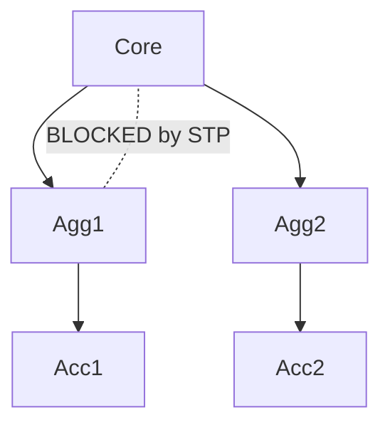

# Chapter 1: The Data Center Revolution — Why VXLAN Exists

## The Problem Nobody Saw Coming

In 2010, a typical enterprise data center had maybe 50-100 VLANs. The network team managed them with a spreadsheet, and everyone was fine. Then came virtualization.

VMware ESXi, Hyper-V, and KVM didn't just change compute — they broke the network's fundamental assumptions. Suddenly:

- A single physical server hosted 50+ VMs, each needing its own Layer 2 segment
- VMs migrated live between racks (vMotion), demanding L2 adjacency across the entire fabric
- Multi-tenant cloud providers needed *thousands* of isolated networks per physical infrastructure
- The 4094 VLAN limit went from "plenty" to "embarrassing"

The IEEE 802.1Q VLAN tag uses a 12-bit VLAN ID. That gives you 4094 usable VLANs (0 and 4095 are reserved). For a service provider hosting 10,000 tenants, each needing 5 segments? You're done before you start.

## The Spanning Tree Straitjacket

Traditional Layer 2 networks use Spanning Tree Protocol (STP) to prevent loops. STP's solution to loops is elegant in its brutality: **block half your links**.

In a modern data center with CLOS/Spine-Leaf topologies, you want **every link active, every path used**. STP makes this impossible. You need a network where:

- All uplinks forward simultaneously (ECMP)
- There is no "root bridge" election drama
- Adding a leaf switch doesn't require reconvergence
- The topology is predictable and symmetric

## The MAC Address Table Explosion

Traditional L2 switching learns MAC addresses in hardware TCAM. In a large L2 domain:

- Every switch must learn every MAC in that domain
- MAC table overflow causes flooding (unknown unicast → broadcast)
- Flooding in a large L2 domain = broadcast storm territory
- ARP/ND tables grow proportionally

A single VXLAN segment with proper EVPN control plane means each VTEP only learns MACs it *needs* to forward traffic — not every MAC in the entire L2 domain.

## The Multi-Tenant Imperative

Cloud providers (AWS, Azure, GCP) and enterprise private clouds need:

| Requirement | VLANs Can Do It? | VXLAN Can Do It? |
|-------------|-----------------|-----------------|
| 16M+ isolated segments | No (4094 max) | Yes (24-bit VNI) |
| Tenant isolation at scale | Painful | Native |
| L2 stretch across DCs | STP nightmare | Trivial |
| Live VM migration (L2 mobility) | Limited to L2 domain | Any VTEP, anywhere |
| Underlay independence | Tightly coupled | Fully decoupled |

## The Birth of VXLAN

In 2011, a consortium of VMware, Cisco, Arista, Red Hat, Broadcom, Citrix, and Emulex published the VXLAN draft. The core insight was deceptively simple:

> **What if we just wrap the entire original Ethernet frame inside a UDP packet and route it across an IP network?**

That's it. That's the whole idea. The original frame becomes *payload*. The outer IP header provides routing. A 24-bit field in a small header provides segment identification. The underlying network doesn't need to know or care about the inner Ethernet.

This is called an **overlay network**, and VXLAN is its most successful implementation.

## What VXLAN Actually Solves

Let's be precise about what VXLAN addresses:

1. **Scale**: 24-bit VNI = 16,777,216 segments (vs 4094 VLANs)
2. **L2 over L3**: Extends Layer 2 segments across any routed infrastructure
3. **Underlay independence**: The physical topology (Spine-Leaf, ring, whatever) becomes a transport. Change it without touching tenant networks.
4. **ECMP-friendly**: Outer IP/UDP headers enable equal-cost multipath across all links
5. **Multi-tenancy**: Each VNI is a fully isolated broadcast domain
6. **VM mobility**: As long as the destination VTEP can reach the source VTEP, the VM's L2 identity is preserved

## What VXLAN Does NOT Solve (By Itself)

This is critical for CCIE candidates. VXLAN alone is just encapsulation. It says nothing about:

- **How VTEPs discover each other** → You need a control plane (multicast, static, or EVPN)
- **How to route between VNIs** → You need a routing solution (IRB, centralized gateway)
- **How to handle ARP efficiently** → You need ARP suppression or EVPN
- **How to secure the overlay** → You need policy, segmentation, microsegmentation
- **How to automate it at scale** → You need APIs, controllers, or IaC

VXLAN is the *data plane encapsulation*. Everything else is built on top.

## The CCIE DC Perspective

For the CCIE Data Center exam (350-601 DCCOR), you need to understand:

- Why traditional L2 fails at scale (STP, VLAN limits, MAC scalability)
- The overlay/underlay model conceptually
- VXLAN as defined in RFC 7348
- How VXLAN fits into Cisco's ACI and Nexus 9000 fabric solutions
- The relationship between VXLAN and EVPN (RFC 8365)

For the lab (300-630 DCACI), you'll configure and troubleshoot VXLAN on Nexus 9000 platforms, both in standalone NX-OS mode and within ACI.

## Key Takeaways

- VLANs hit a hard limit at 4094. VXLAN gives you 16 million segments.
- STP wastes bandwidth. VXLAN over a CLOS underlay uses every link.
- VXLAN is encapsulation, not a complete solution. It needs a control plane.
- The underlay becomes "just IP" — simple, scalable, well-understood.
- The overlay carries tenant semantics — VLANs, MACs, broadcast domains.

## What's Next

In Chapter 2, we'll formalize the overlay/underlay model and understand how network virtualization works conceptually — the mental model you'll use for every subsequent chapter.
