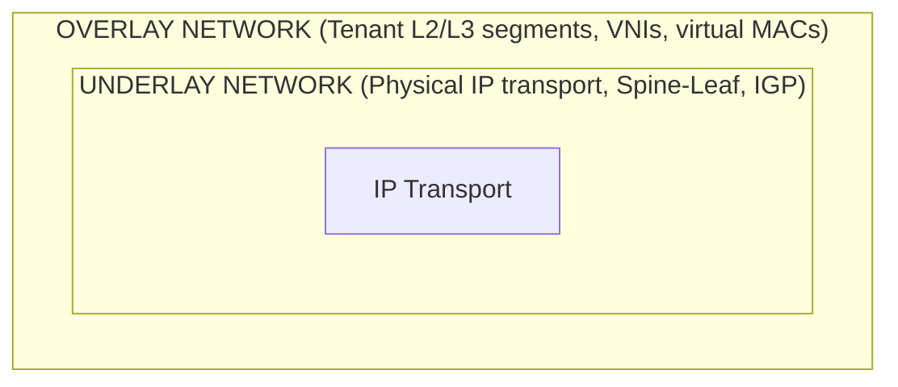
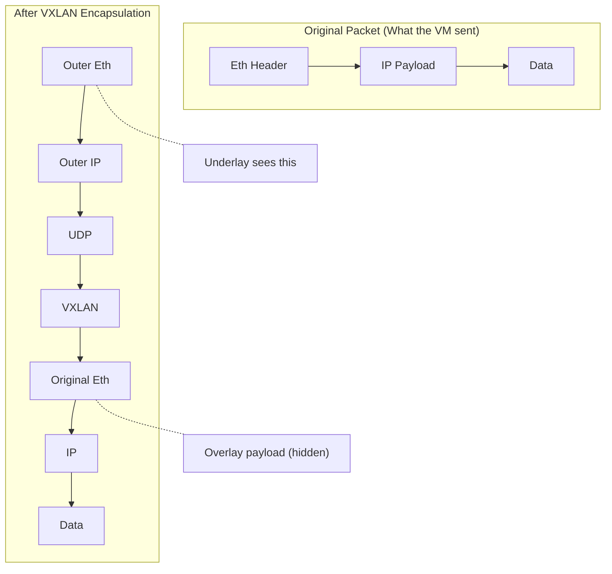
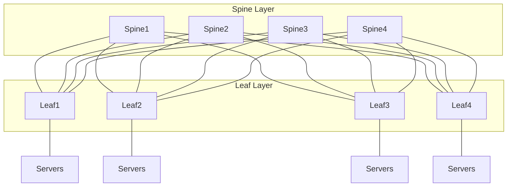
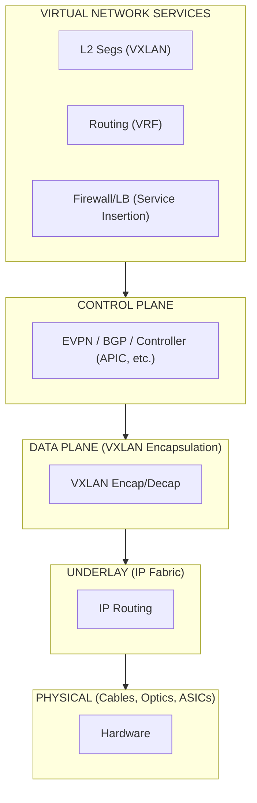
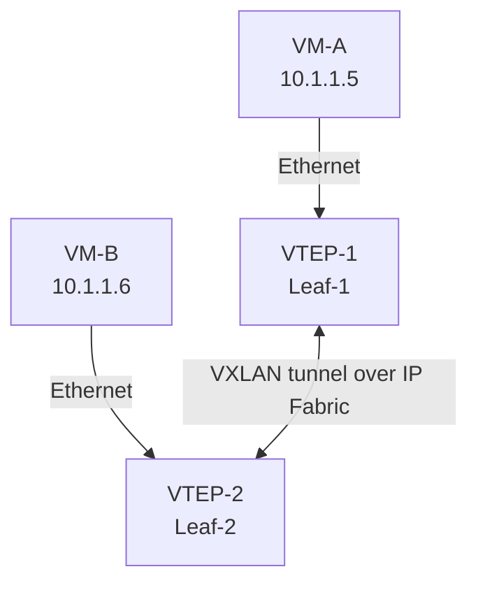

# Chapter 2: Network Virtualization & Overlay Fundamentals

## The Two Networks You Must Understand

Every VXLAN deployment involves **two networks** operating simultaneously:

**Underlay**: The physical (or virtual) IP network. Routers and switches running OSPF/IS-IS/BGP. It provides IP connectivity between endpoints. It knows nothing about tenants, VLANs, or VXLAN.

**Overlay**: The virtual network built on top. VXLAN tunnels between VTEPs. Tenant L2 segments identified by VNIs. The overlay is what tenants and VMs see.

The beauty: **the underlay doesn't know the overlay exists**. A spine switch forwarding a VXLAN packet sees only an IP packet with a UDP payload. It routes it like any other packet. This decoupling is the entire point.

## The Tunnel Concept

A tunnel is a lie you tell the network. You take a packet, wrap it in another packet, and the intermediate devices only see the wrapper.

The intermediate switches/routers:
- Read the **outer** IP header for forwarding decisions
- Never inspect the inner packet
- Don't maintain state for the overlay
- Can be changed, upgraded, or rerouted without affecting tenants

## Overlay vs. Underlay: Division of Responsibility

| Concern | Underlay Handles | Overlay Handles |
|---------|-----------------|-----------------|
| Physical connectivity | Yes | No |
| IP reachability between VTEPs | Yes | No |
| Loop prevention | IGP + ECMP (no STP) | N/A (no L2 loops in underlay) |
| Tenant isolation | No | Yes (VNI) |
| MAC learning | No | Yes (VTEP MAC tables) |
| Broadcast domains | No | Yes (per-VNI) |
| Routing between segments | No | Yes (VXLAN routing) |
| QoS (transport level) | Yes | Marked in outer header |
| QoS (tenant level) | No | Inner headers / policy |

## The CLOS / Spine-Leaf Underlay

Modern VXLAN deployments almost universally use a **CLOS topology** (Spine-Leaf) for the underlay:

Why CLOS?

1. **Every leaf connects to every spine** → uniform latency, predictable paths
2. **All links are equal-cost** → perfect for ECMP hashing
3. **No STP needed** → the IGP (OSPF/IS-IS) handles loop-free paths
4. **Scales horizontally** → add spines for bandwidth, add leaves for ports
5. **Failure is graceful** → lose a spine, traffic rehashes across remaining spines

### Underlay IGP Choices

| Protocol | Pros | Cons |
|----------|------|------|
| OSPF | Well-known, simple | Area design complexity at scale |
| IS-IS | Scales better, TLV-based | Less familiar to many engineers |
| eBGP (underlay) | Simple, no IGP state, policy-rich | Requires /31s or loopbacks |
| Unnumbered IS-IS | Zero IP config on links | Harder to troubleshoot |

For CCIE DC, you'll see OSPF and eBGP underlays most often on Nexus 9000.

## Network Virtualization: The Big Picture

Network virtualization isn't just VXLAN. It's a complete rethinking:

Each layer is independent. You can:
- Change the physical topology without touching tenant configs
- Add a new tenant without reconfiguring the underlay
- Insert services without rewiring
- Migrate workloads without network changes

## The VTEP: Where Two Worlds Meet

The **VXLAN Tunnel Endpoint (VTEP)** is the device that sits at the boundary between underlay and overlay. It:

1. Receives a frame from a VM/server (overlay side)
2. Encapsulates it in VXLAN/UDP/IP (adds underlay headers)
3. Forwards it into the IP fabric (underlay side)
4. In reverse: decapsulates incoming VXLAN packets and delivers the inner frame

On Cisco Nexus 9000, the VTEP function is performed by the switch's ASIC (hardware VXLAN). On a hypervisor, it's the vSwitch (VMware VDS, Open vSwitch, etc.).

VM-A sends a frame to VM-B. VTEP-1 encapsulates it. The IP fabric routes the outer packet to VTEP-2. VTEP-2 decapsulates and delivers the original frame. VM-B never knows the frame crossed an IP network.

## Key Concepts to Internalize

1. **The underlay is "dumb" IP transport.** It routes packets between VTEP IP addresses. Period.
2. **The overlay is "smart" virtual networking.** It handles MACs, VLANs, broadcast domains, routing.
3. **Encapsulation is the bridge.** The original frame is preserved intact inside the VXLAN packet.
4. **Scale comes from separation.** The underlay scales with IGP best practices. The overlay scales with EVPN.
5. **The VTEP is the critical device.** It must do encapsulation/decapsulation at line rate in hardware.

## Mental Model for the Rest of This Book

For every subsequent chapter, ask yourself:

- "Is this an underlay concern or an overlay concern?"
- "What does the VTEP do here?"
- "What does the intermediate (spine) device see?"
- "What does the end host (VM) experience?"

If you can answer these four questions for any VXLAN topic, you understand it.

## What's Next

Chapter 3 dives into VXLAN architecture formally — the components, the terminology, and how all the pieces fit together in a real deployment.
