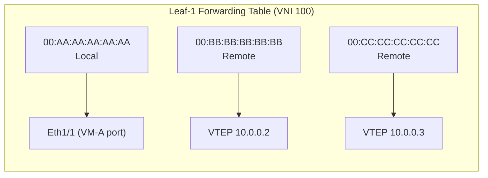
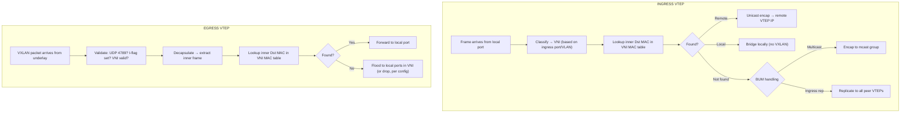

# Chapter 5: VXLAN Data Plane — Unicast, Multicast & BUM Traffic

## Three Types of Traffic, Three Different Stories

In a VXLAN fabric, traffic falls into three categories, and each is handled differently:

| Type | What It Is | Example |
|------|-----------|---------|
| **Unicast** | Known destination MAC | VM-A → VM-B (MAC already learned) |
| **Unknown Unicast** | Unknown destination MAC | First packet to a new VM |
| **BUM** | Broadcast, Unknown unicast, Multicast | ARP requests, DHCP discovers, ND |

Unicast is simple. BUM is where VXLAN gets interesting (and where designs diverge).

## Unicast Forwarding (The Happy Path)

Once MACs are learned, unicast is straightforward:

```
VM-A (Leaf-1, VNI 100) → VM-B (Leaf-2, VNI 100)

1. VM-A sends frame: dst=MAC-B, src=MAC-A
2. Leaf-1 looks up MAC-B in VNI 100 table → remote VTEP 10.0.0.2
3. Leaf-1 encapsulates: outer dst IP = 10.0.0.2, VNI = 100
4. Underlay routes packet to Leaf-2
5. Leaf-2 decapsulates, looks up MAC-B → local port Eth1/5
6. Frame delivered to VM-B
```

The forwarding table on Leaf-1 for VNI 100:



**Key point:** Unicast forwarding is *reactive*. The VTEP must already know where the destination MAC lives. How it learns this is the **control plane's** job (Chapter 6-9).

## BUM Traffic: The Hard Problem

In a traditional L2 network, BUM is easy: flood it out all ports in the VLAN. The switch doesn't need to know where anyone is.

In VXLAN, "all ports in the VLAN" means "all VTEPs hosting this VNI, and all their local ports." How does a VTEP deliver a broadcast to all remote VTEPs?

There are three approaches:

### Approach 1: Multicast in the Underlay

The original RFC 7348 method. Each VNI maps to a multicast group in the underlay.

```
VNI 100 → Underlay multicast group 239.1.1.100
VNI 200 → Underlay multicast group 239.1.1.200
VNI 300 → Underlay multicast group 239.1.1.300
```

**How it works:**
1. VM-A sends an ARP broadcast
2. Leaf-1 encapsulates it with outer dst IP = 239.1.1.100
3. Underlay multicast (PIM) delivers it to all VTEPs that joined 239.1.1.100
4. Each VTEP decapsulates and floods to local ports in VNI 100

**Configuration (NX-OS):**
```
feature pim

interface nve1
  member vni 100
    mcast-group 239.1.1.100
  member vni 200
    mcast-group 239.1.1.200
```

**Pros:**
- Efficient: only VTEPs interested in a VNI receive its BUM traffic
- Leverages existing multicast infrastructure
- No head-end replication burden on ingress VTEP

**Cons:**
- Requires PIM in the underlay (operational complexity)
- Multicast state in every underlay router
- Harder to troubleshoot
- Many operators refuse to run multicast
- Mapping 16M VNIs to multicast groups requires planning

### Approach 2: Head-End Replication (Ingress Replication)

The ingress VTEP replicates BUM traffic and sends a **separate unicast copy** to every remote VTEP in that VNI.

```
VM-A sends ARP broadcast on VNI 100.
Leaf-1 knows VNI 100 exists on: Leaf-2, Leaf-3, Leaf-4

Leaf-1 creates 3 copies:
  Copy 1: outer dst = 10.0.0.2 (Leaf-2)
  Copy 2: outer dst = 10.0.0.3 (Leaf-3)
  Copy 3: outer dst = 10.0.0.4 (Leaf-4)
```

**Configuration (NX-OS with BGP EVPN):**
```
interface nve1
  member vni 100
    ingress-replication protocol bgp
```

**Pros:**
- No multicast needed in underlay
- Simpler underlay (pure unicast IP)
- Works with any IGP
- EVPN naturally provides the VTEP list

**Cons:**
- Ingress VTEP must replicate N copies (CPU/ASIC burden)
- Scales poorly with many VTEPs per VNI
- Bandwidth waste: N copies traverse the first uplink
- "Replication storm" risk with many VNIs and many VTEPs

**Scaling math:**
```
If VNI 100 spans 50 VTEPs:
  Each BUM packet → 49 unicast copies from ingress VTEP
  If 100 VNIs each span 50 VTEPs:
    A single broadcast storm → 4,900 replicated packets per VTEP
```

### Approach 3: EVPN with P-Multicast (Hybrid)

Use EVPN for control plane (MAC/IP learning) but use **underlay multicast** for BUM delivery. Best of both worlds.

```
Control plane: EVPN (BGP) → MAC/IP routes, VTEP discovery
Data plane BUM: P-multicast → efficient replication in underlay
Data plane Unicast: Direct VTEP-to-VTEP (as always)
```

This is the recommended approach for large-scale deployments.

## BUM Traffic Comparison

| Aspect | Underlay Multicast | Head-End Replication | Hybrid (EVPN + mcast) |
|--------|-------------------|---------------------|----------------------|
| Underlay requirement | PIM + multicast | None (unicast only) | PIM + multicast |
| Ingress VTEP burden | Low (one packet) | High (N copies) | Low (one packet) |
| Scalability | Good | Limited | Best |
| Operational complexity | Medium-High | Low | Medium |
| Typical use | Legacy / RFC 7348 | Small-medium fabrics | Large-scale / SP |

## ARP and Neighbor Discovery

ARP is the most common BUM traffic in an IPv4 overlay. Without optimization, every ARP request is flooded to all VTEPs.

**The problem at scale:**
```
10,000 VMs in VNI 100 across 100 VTEPs
VM-A ARPs for VM-B's MAC
→ Flooded to all 100 VTEPs
→ Each VTEP floods to ~100 local VMs
→ 10,000 VMs process the ARP
→ Only 1 VM (VM-B) responds
→ 99.99% wasted processing
```

**Solutions (covered in depth in Chapters 7-9):**

1. **ARP Suppression (local):** VTEP answers ARP on behalf of known hosts
2. **EVPN MAC/IP routes:** VTEPs learn MAC+IP via BGP, no ARP flooding needed
3. **Proxy ARP / Distributed Anycast Gateway:** Default gateway answers all ARPs

## Unknown Unicast Handling

When a VTEP receives a frame with a destination MAC it doesn't recognize:

**Option A: Flood (like BUM)**
- Treat as BUM, replicate to all VTEPs in the VNI
- Safe but wasteful
- Default behavior in many implementations

**Option B: Drop**
- If the control plane (EVPN) should have all MACs, unknown unicast means something is wrong
- Drop and log → helps identify issues
- Some designs use this for security

**NX-OS configuration:**
```
interface nve1
  member vni 100
    suppress-arp
    unknown-unicast-drop    ← Drop instead of flood
```

## Multicast in the Overlay

Overlay multicast (e.g., for video distribution, PIM in tenant networks) adds another layer:

```
Overlay multicast group 239.100.100.1 (tenant application)
  → Mapped to underlay multicast group 239.1.1.100 (transport)
  → Or replicated head-end per VTEP
```

This is called **multicast overlay over unicast underlay** or **multicast overlay over multicast underlay**, depending on design.

For CCIE DC, focus on:
- How overlay multicast groups map to underlay groups
- IGMP snooping in the overlay (per-VNI)
- PIM in the overlay (if tenant needs multicast routing)

## Data Plane Verification Commands (NX-OS)

```bash
# Show VXLAN VNI configuration and status
show nve vni

# Show MAC addresses learned per VNI
show mac address-table vlan 100

# Show VTEP peers (remote VTEPs per VNI)
show nve peers

# Show VNI details including BUM method
show nve vni 100 detail

# Show encapsulation statistics
show interface nve1 counters

# Verify underlay reachability to remote VTEPs
ping 10.0.0.2 source-interface loopback0

# Check for drops
show interface nve1 counters errors
show hardware internal access-list manager stats
```

**Example output:**
```
Nexus9K# show nve vni 100 detail
VNI: 100
  State: Up
  Vlan: 100
  Multicast Group: 0.0.0.0          ← No multicast (using ingress replication)
  Peer Count: 3
  Peer IPs: 10.0.0.2, 10.0.0.3, 10.0.0.4
  Ingress Replication: BGP
  Suppress ARP: Enabled
  Unknown Unicast: Drop
```

## Traffic Flow Summary



## Key Takeaways

- Unicast forwarding requires prior MAC learning (control plane's job).
- BUM traffic is the design differentiator: multicast vs head-end replication.
- Head-end replication is simpler but doesn't scale to thousands of VTEPs per VNI.
- ARP suppression and EVPN eliminate most BUM traffic in practice.
- MTU and ECMP hashing are the two most common data plane issues.
- Always verify with `show nve vni`, `show nve peers`, and packet captures.

## What's Next

Chapter 6 explores the control plane — how VTEPs actually learn remote MACs and discover each other. This is where multicast control plane, static configuration, and the modern EVPN approach diverge.
