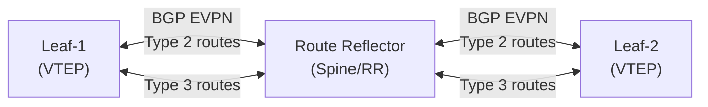

# Chapter 6: VXLAN Control Plane — Multicast to Head-End Replication

## The Control Plane Question

The data plane (Chapter 5) tells you *how* packets are encapsulated and forwarded. The control plane answers a more fundamental question:

> **How does VTEP-A know that MAC 00:BB:BB:BB:BB:BB lives behind VTEP-B?**

Without this knowledge, every unicast packet would have to be flooded like BUM. The control plane builds the forwarding tables that make unicast efficient.

There are four control plane options for VXLAN:

| Method | RFC/Standard | Complexity | Scale | Modern Use |
|--------|-------------|-----------|-------|-----------|
| Static/Manual | N/A | Low | Terrible | Lab only |
| Multicast (flood & learn) | RFC 7348 | Medium | Medium | Legacy |
| Head-End Replication + flood & learn | RFC 7348 | Low | Limited | Small deployments |
| **EVPN (BGP)** | RFC 8365 | Medium-High | **Excellent** | **Production standard** |

## Option 1: Static Configuration

You manually configure every MAC-to-VTEP mapping on every VTEP.

```
mac address-table static 00:BB:BB:BB:BB:BB vlan 100 vtep 10.0.0.2
mac address-table static 00:CC:CC:CC:CC:CC vlan 100 vtep 10.0.0.3
```

**Verdict:** Unusable beyond a 3-node lab. Every VM migration, every new host, requires manual updates on every VTEP. Mentioned here only for completeness.

## Option 2: Multicast Control Plane (Flood & Learn)

This is the original RFC 7348 approach. It uses **underlay multicast** for both BUM delivery AND MAC learning.

### How It Works

**MAC Learning (the "learn" part):**
1. VM-A sends a frame. Leaf-1 encapsulates and sends to the VNI's multicast group.
2. All VTEPs in that VNI receive the frame (via PIM multicast).
3. Each VTEP sees the **inner source MAC** and the **outer source IP** (the sending VTEP).
4. Each VTEP records: "MAC-A is reachable via VTEP 10.0.0.1 in VNI 100."

**Forwarding (the "flood" part):**
- Unknown unicast and BUM → sent to multicast group → all VTEPs receive
- Known unicast → sent directly to the learned VTEP IP

### Configuration

```
feature pim
feature vn-segment-vlan-based

! Underlay multicast
interface Ethernet1/1
  ip pim sparse-mode
  ip router ospf UNDERLAY area 0

! PIM RP configuration
ip pim rp-address 10.255.255.1 group-list 239.0.0.0/8

! VNI to multicast group mapping
interface nve1
  source-interface loopback0
  member vni 100
    mcast-group 239.1.1.100
  member vni 200
    mcast-group 239.1.1.200
```

### The Multicast Group Mapping Problem

You have 16 million possible VNIs. You have a finite multicast address space (239.0.0.0/8 = ~16M groups, but practical limits apply). Mapping strategies:

1. **1:1 mapping** — each VNI gets its own group. Clean but requires planning.
2. **Many:1 mapping** — multiple VNIs share a group. Wastes bandwidth (VTEPs receive BUM for VNIs they don't host).
3. **Algorithmic** — VNI + base = group address. E.g., 239.1.(VNI/256).(VNI%256).

### Pros and Cons

**Pros:**
- No BGP required
- MAC learning is automatic (flood & learn)
- Efficient BUM delivery (only interested VTEPs join the group)

**Cons:**
- Requires PIM in the underlay (RP, join/prune state, (*,G) and (S,G) entries)
- Multicast is operationally complex and many teams avoid it
- MAC learning is reactive — first packet is always flooded
- No built-in ARP suppression
- Scaling to thousands of VNIs with unique groups is painful
- Troubleshooting multicast is notoriously difficult

## Option 3: Head-End Replication (Ingress Replication)

Eliminates multicast entirely. BUM traffic is replicated by the ingress VTEP as unicast copies to all peers.

### How MAC Learning Works

Without EVPN, head-end replication still uses **flood & learn**:
1. Unknown destination → flood to all peers (unicast copies)
2. Remote VTEPs receive the frame, learn source MAC from inner header
3. Subsequent traffic to that MAC goes directly (unicast)

### Configuration

```
interface nve1
  source-interface loopback0
  member vni 100
    ingress-replication protocol static
    peer-ip 10.0.0.2
    peer-ip 10.0.0.3
    peer-ip 10.0.0.4
```

Or with BGP (more common — BGP distributes the peer list):
```
interface nve1
  source-interface loopback0
  member vni 100
    ingress-replication protocol bgp
```

### The Scaling Problem

```
N VTEPs in a VNI → each BUM packet generates (N-1) copies
M VNIs on a VTEP → total replication factor = M × (N-1)

Example: 100 VNIs, each spanning 20 VTEPs
  Each BUM packet → 19 copies per VNI
  If all 100 VNIs have simultaneous BUM → 1,900 packets generated
```

This is why head-end replication is fine for 10-20 VTEPs but breaks down at 100+.

## Option 4: EVPN — The Modern Standard

EVPN (Ethernet VPN, RFC 7432) was designed for MPLS networks but adapted for VXLAN in RFC 8365. It replaces flood & learn with **proactive MAC/IP advertisement via BGP**.

### Why EVPN Wins

| Capability | Flood & Learn | EVPN |
|-----------|-------------|------|
| MAC learning | Reactive (flood first) | Proactive (BGP advertises) |
| ARP handling | Flood ARP to all | ARP suppression (MAC/IP routes) |
| Unknown unicast | Must flood | Can drop (all MACs known) |
| Multi-homing | STP (active/standby) | All-active (EVPN MH) |
| Route reflectors | N/A | Scale to thousands of VTEPs |
| Inter-VNI routing | External router needed | Integrated (IRB) |
| Convergence | Slow (flood until learned) | Fast (BGP withdraw) |

### EVPN Control Plane Overview



- **Type 2 (MAC/IP Advertisement):** "I have MAC 00:AA:AA:AA:AA:AA with IP 10.1.1.5 in VNI 100, reachable via my VTEP IP 10.0.0.1"
- **Type 3 (Inclusive Multicast):** "I participate in VNI 100. My VTEP IP is 10.0.0.1. Send BUM here."

With EVPN:
- VTEPs learn ALL remote MACs via BGP (no flooding needed for learning)
- ARP requests can be answered locally (ARP suppression)
- Unknown unicast can be safely dropped
- BUM uses Type 3 routes to build the peer list (then multicast or head-end rep)

## Control Plane Comparison Matrix

| Criterion | Static | Multicast F&L | Head-End F&L | EVPN |
|-----------|--------|--------------|-------------|------|
| Underlay requirement | IP | IP + PIM | IP only | IP + BGP |
| MAC learning | Manual | Flood | Flood | BGP (proactive) |
| BUM delivery | N/A | Multicast | Unicast copies | Multicast or HER |
| ARP efficiency | N/A | Poor (flood) | Poor (flood) | Excellent (suppress) |
| Scale (VTEPs) | <5 | ~100 | ~20-50 | 1000+ |
| Scale (VNIs) | <10 | ~1000 | ~100 | 10000+ |
| Convergence | Manual | Slow | Slow | Fast (BGP) |
| Operational skill | Low | High (mcast) | Low | Medium (BGP) |
| CCIE DC relevance | None | Know it | Know it | **Master it** |

## The Evolution in Practice

Most deployments follow this path:

```
Lab/PoC:        Static or Head-End Replication (quick to configure)
Small prod:     Head-End Replication + BGP (no multicast needed)
Medium prod:    EVPN + Head-End Replication (scalable control, simple underlay)
Large prod:     EVPN + Underlay Multicast for BUM (best scale)
Service Prov:   EVPN + P-multicast + Route Reflectors (maximum scale)
```

## Verification: Control Plane Health

```bash
# BGP EVPN sessions
show bgp l2vpn evpn summary

# EVPN routes learned
show bgp l2vpn evpn route-type 2

# VNI peer list (from EVPN Type 3)
show nve peers

# MAC table (should show "remote" entries from BGP)
show mac address-table vlan 100

# ARP suppression entries
show ip arp suppression-cache

# Verify no flood & learn happening (should be minimal unknown unicast)
show interface nve1 counters
```

**Healthy EVPN fabric indicators:**
- All remote MACs show as "BGP" or "remote" in MAC table
- ARP suppression cache is populated
- Unknown unicast counters are near zero
- BUM counters are low (only genuine broadcasts)

**Unhealthy indicators:**
- MACs showing as "flood" learned
- High unknown unicast counters
- ARP suppression cache empty
- BGP sessions flapping

## Key Takeaways

- The control plane determines how VTEPs learn remote MACs and discover peers.
- Flood & learn (multicast or head-end) is reactive and wasteful.
- EVPN is proactive: MACs and IPs are advertised via BGP before traffic flows.
- EVPN enables ARP suppression, unknown unicast drop, and fast convergence.
- For CCIE DC, EVPN is the control plane you must master.
- Head-end replication is acceptable for small fabrics; multicast BUM for large.

## What's Next

Chapter 7 formally introduces EVPN — its concepts, terminology, and why it was designed. You'll understand EVPN as a technology in its own right before we integrate it with VXLAN.
