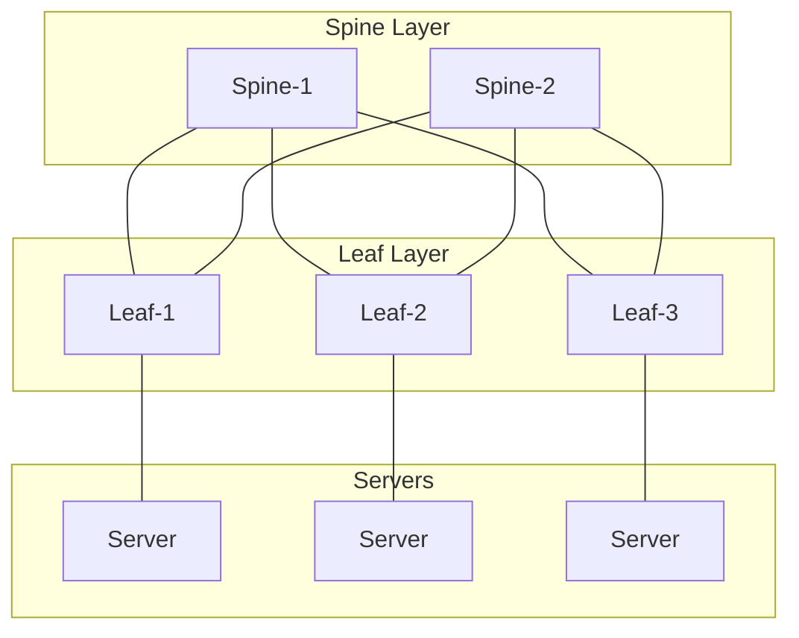

# Chapter 18: CCIE DC Lab Scenarios & Exam Preparation

## The Exam Landscape

The CCIE Data Center certification has two components:

| Exam | Code | Duration | Format | VXLAN Weight |
|------|------|----------|--------|-------------|
| DCCOR (Written) | 350-601 | 120 min | Multiple choice | ~15-20% |
| DCACI (Lab) | 300-630 | 8 hours | Hands-on config | ~25-30% |

VXLAN/EVPN is the **single largest topic** in both exams. Master it, and you've conquered a third of the certification.

## What DCCOR Tests (Written)

### Knowledge Areas

1. **Conceptual understanding**
   - Why VXLAN exists (VLAN limits, STP, MAC scalability)
   - Overlay vs underlay model
   - VTEP, VNI, encapsulation concepts

2. **Packet format**
   - 50-byte overhead calculation
   - UDP port 4789
   - VNI field (24-bit)
   - ECMP entropy (UDP source port)

3. **Control plane comparison**
   - Multicast vs head-end replication vs EVPN
   - EVPN route types (1-5) and their purposes
   - Route reflectors for scale

4. **Design decisions**
   - Spine-leaf topology
   - Anycast gateway
   - Symmetric vs asymmetric IRB
   - Multi-site considerations

5. **ACI concepts**
   - Tenant/BD/EPG/Contract model
   - How ACI uses VXLAN internally
   - COOP vs EVPN

### Sample DCCOR Questions

**Q1:** What is the total overhead added by VXLAN encapsulation?
- A) 28 bytes
- B) 50 bytes ✓
- C) 58 bytes
- D) 64 bytes

**Q2:** Which EVPN route type is used for MAC/IP advertisement?
- A) Type 1
- B) Type 2 ✓
- C) Type 3
- D) Type 5

**Q3:** What UDP destination port does VXLAN use?
- A) 8472
- B) 4789 ✓
- C) 6081
- D) 16384

**Q4:** In an EVPN-VXLAN fabric, what eliminates the need for ARP flooding?
- A) PIM in the underlay
- B) Type 3 routes
- C) ARP suppression using Type 2 MAC/IP routes ✓
- D) STP port-fast

## What DCACI Tests (Lab)

### Lab Topology (Typical)



Tasks: Configure VXLAN EVPN fabric, verify, troubleshoot.

### Lab Task Categories

#### Category 1: Build the Fabric (Day-1)

**Typical task:** "Configure a VXLAN EVPN fabric with the following requirements:
- Underlay: OSPF area 0, MTU 9216
- VNI 100: subnet 10.1.1.0/24, anycast gateway
- VNI 200: subnet 10.2.1.0/24, anycast gateway
- VRF Tenant-A with L3 VNI 10000
- BGP ASN 65000, spines as route reflectors
- ARP suppression enabled
- Ingress replication for BUM"

**Time budget:** 45-60 minutes for full fabric config across 5 switches.

**Key commands to memorize:**
```
feature ospf
feature bgp
feature interface-vlan
feature vn-segment-vlan-based
feature nv overlay
feature fabric forwarding

fabric forwarding anycast-gateway-mac 0000.1111.1111

vlan 100
  vn-segment 100

interface nve1
  no shutdown
  source-interface loopback0
  host-reachability protocol bgp
  member vni 100
    suppress-arp
    ingress-replication protocol bgp

router bgp 65000
  address-family l2vpn evpn
    retain route-target all
  neighbor <spine-ip>
    remote-as 65000
    update-source loopback0
    address-family l2vpn evpn
      send-community both
```

#### Category 2: Verify and Validate

**Typical task:** "Verify the VXLAN fabric is operating correctly. Document:
- All BGP EVPN sessions are established
- Type 2 routes are exchanged for all hosts
- ARP suppression is functioning
- Inter-VNI routing works between VNI 100 and VNI 200"

**Verification sequence:**
```bash
show bgp l2vpn evpn summary
show bgp l2vpn evpn route-type 2
show nve vni
show nve peers
show mac address-table vlan 100
show ip arp suppression-cache
show ip route vrf Tenant-A
ping 10.2.1.5 source 10.1.1.5 vrf Tenant-A
```

#### Category 3: Troubleshoot (The Hard Part)

**Typical task:** "VM-A (10.1.1.5) cannot reach VM-B (10.1.1.6). Both are in VNI 100. Diagnose and fix the issue."

**Injected faults (examples):**
- OSPF area mismatch on one uplink
- `send-community both` missing on one BGP neighbor
- MTU set to 1500 on spine interface
- VNI not added to NVE on one leaf
- Wrong VRF on SVI
- Route-reflector-client missing on spine
- `host-reachability protocol bgp` missing (falls back to flood & learn)
- Anycast gateway MAC mismatch between leaves

**Strategy:** Use the systematic approach from Chapter 17. Don't guess. Verify each layer.

#### Category 4: Modify / Extend

**Typical task:** "Add VNI 300 (subnet 10.3.1.0/24) to the existing fabric. Ensure:
- It's part of VRF Tenant-A
- Inter-VNI routing works with VNI 100 and 200
- ARP suppression is enabled
- Only Leaf-1 and Leaf-3 host this VNI"

#### Category 5: ACI Tasks

**Typical task:** "Using APIC, create:
- Tenant: Production
- VRF: Prod-VRF
- Bridge Domain: Web-BD (subnet 10.1.1.1/24, shared)
- EPG: Web-EPG (static binding to Leaf-1, Eth1/1, VLAN 100)
- Contract: Allow HTTP/HTTPS between Web-EPG and App-EPG"

## Study Strategy

### Phase 1: Foundation (Weeks 1-4)

- Read Chapters 1-6 of this book
- Understand the "why" before the "how"
- Build a 3-node lab (EVE-NG, CML, or physical)
- Configure basic VXLAN with multicast, then head-end replication
- **Goal:** Can you explain VXLAN to someone else clearly?

### Phase 2: EVPN Mastery (Weeks 5-8)

- Read Chapters 7-10
- Configure full EVPN-VXLAN fabric from scratch (no guide)
- Break it, fix it, break it differently
- Practice all route types: verify Type 2, 3, 5 in output
- Configure inter-VNI routing, verify with ping/traceroute
- **Goal:** Can you build a 5-switch EVPN-VXLAN fabric in 45 minutes?

### Phase 3: Scale and Design (Weeks 9-12)

- Read Chapters 11-15
- Add route reflectors, multi-homing, multi-site
- Practice ACI configuration (APIC simulator or rack rental)
- Study design tradeoffs (multicast vs HER, symmetric vs asymmetric IRB)
- **Goal:** Can you design a 32-leaf fabric and justify every decision?

### Phase 4: Speed and Troubleshooting (Weeks 13-16)

- Read Chapters 16-18
- Timed labs: full fabric build in 60 minutes
- Troubleshooting drills: have a partner inject faults
- Practice verification commands until they're reflexive
- **Goal:** Can you find and fix a VXLAN issue in under 10 minutes?

## Lab Resources

| Resource | Type | Cost |
|----------|------|------|
| Cisco CML | Virtual lab | ~$200/yr |
| EVE-NG + NX-OSv | Virtual lab | Free (images separate) |
| Cisco dCloud | Remote rack | Free (Cisco account) |
| INE / Narbik | Training + rack | $$$ |
| IPExpert | Training + rack | $$$ |
| This book + practice | Self-study | Free |

## Exam Day Tips

### For DCCOR (Written)

- Read questions carefully — "which is NOT" questions are common
- Know the numbers: 24-bit VNI, UDP 4789, 50-byte overhead, 4094 VLAN limit
- Understand EVPN route types by number and purpose
- Know ACI terminology (BD, EPG, Contract, COOP)
- Eliminate obviously wrong answers first

### For DCACI (Lab)

- **First 15 minutes:** Read ALL tasks. Plan your order.
- **Underlay first.** Always. If underlay is broken, nothing works.
- **Save frequently.** `copy running-config startup-config` after each major step.
- **Verify as you go.** Don't build everything then test. Test each layer.
- **Troubleshooting tasks:** Use systematic approach. Don't shotgun.
- **Time management:** If stuck >10 min, move on. Come back later.
- **ACI tasks:** Know the GUI navigation. Practice the click path.
- **Don't forget:** `send-community both`, `host-reachability protocol bgp`, MTU 9216.

## The 10 Commands You Must Know Cold

```bash
1.  show nve vni
2.  show nve peers
3.  show bgp l2vpn evpn summary
4.  show bgp l2vpn evpn route-type 2
5.  show mac address-table vlan <vlan>
6.  show ip arp suppression-cache
7.  show ip route vrf <vrf>
8.  show interface nve1 counters
9.  show bgp l2vpn evpn route-type 5
10. ping <remote-vtep> source-interface loopback0
```

## Final Words

VXLAN is not just a protocol to memorize. It's a **paradigm** — the shift from hardware-defined networks (VLANs, STP, physical topology) to software-defined networks (overlays, EVPN, programmable fabrics).

The CCIE DC exam tests whether you understand this paradigm deeply enough to:
- Build it from scratch
- Make it scale
- Keep it secure
- Fix it when it breaks
- Explain why you made each design choice

You now have 18 chapters covering every angle. The rest is practice.

Go build a fabric. Break it. Fix it. Repeat.

---

*You've got this. Now go earn those initials.*
