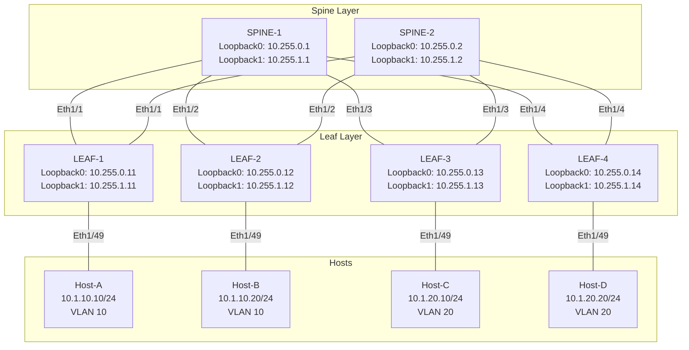
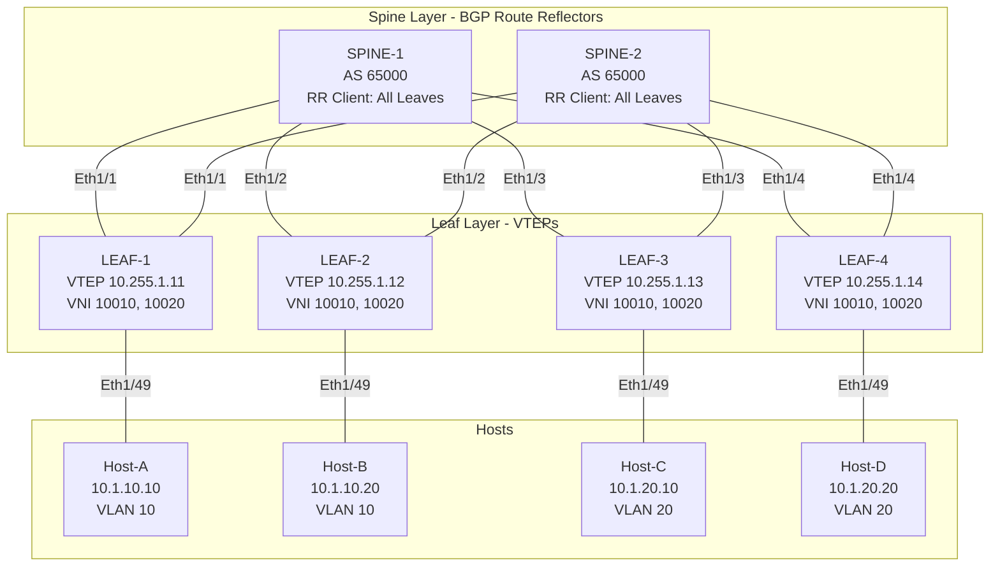
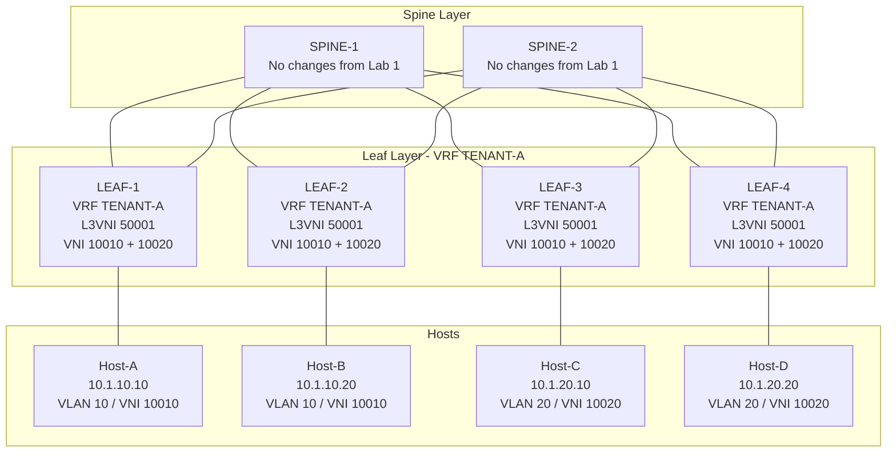
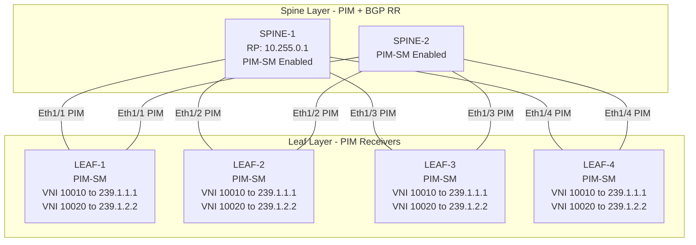
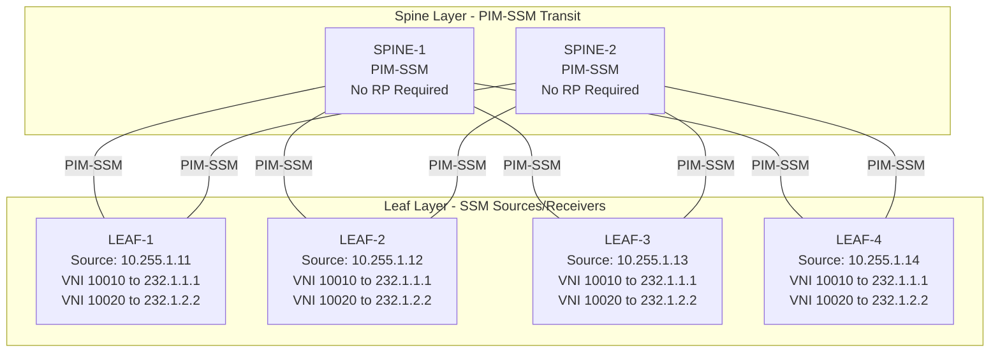
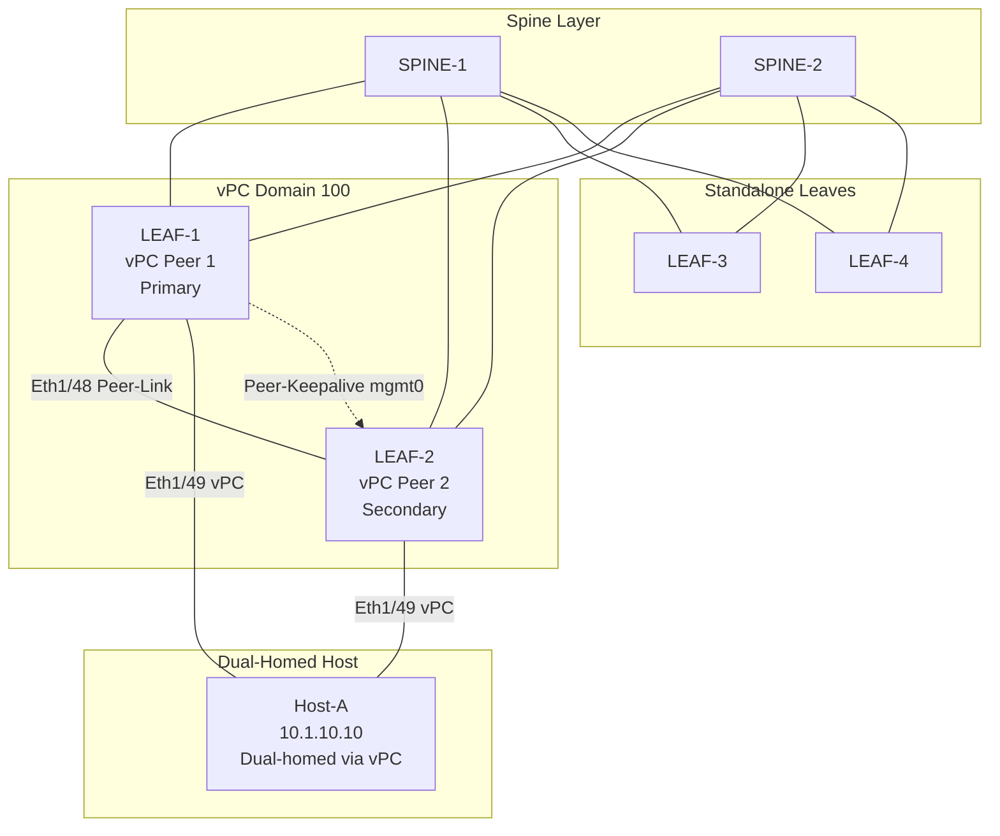
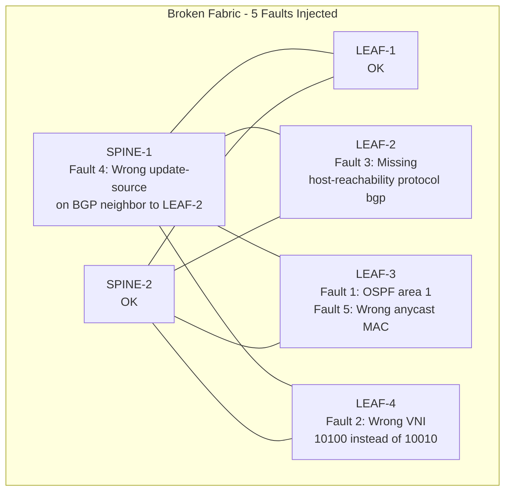

# Chapter 19: VXLAN/EVPN Hands-On Labs (4-Hour Lab Guide)

## Lab Environment Setup

### CML/EVE-NG Requirements

| Component | Requirement |
|-----------|-------------|
| Platform | Cisco CML 2.6+ or EVE-NG 5.0+ |
| RAM | 48 GB minimum (64 GB recommended) |
| vCPU | 16 cores minimum |
| Storage | 100 GB SSD |
| Images | NX-OSv 9000 (nexus9000v) 10.3(x) or later |

### NX-OSv 9000 Images Needed

- `nxosv9k-10.3.4.F.qcow2` (or equivalent 10.x release)
- Each NX-OSv instance: 8 GB RAM, 4 vCPU
- For vPC labs (Lab 5): ensure VMXNET3 NICs are used

### Recommended Topology: 2 Spines + 4 Leaves



### IP Addressing Scheme

#### Underlay Links (Point-to-Point /31)

| Link | SPINE-1 IP | SPINE-2 IP | Leaf IP |
|------|-----------|-----------|---------|
| SPINE-1 to LEAF-1 | Unnumbered | - | Unnumbered |
| SPINE-1 to LEAF-2 | Unnumbered | - | Unnumbered |
| SPINE-1 to LEAF-3 | Unnumbered | - | Unnumbered |
| SPINE-1 to LEAF-4 | Unnumbered | - | Unnumbered |
| SPINE-2 to LEAF-1 | - | Unnumbered | Unnumbered |
| SPINE-2 to LEAF-2 | - | Unnumbered | Unnumbered |
| SPINE-2 to LEAF-3 | - | Unnumbered | Unnumbered |
| SPINE-2 to LEAF-4 | - | Unnumbered | Unnumbered |

#### Loopback Interfaces

| Device | Loopback0 (Router-ID/BGP) | Loopback1 (NVE Source) |
|--------|--------------------------|----------------------|
| SPINE-1 | 10.255.0.1/32 | 10.255.1.1/32 |
| SPINE-2 | 10.255.0.2/32 | 10.255.1.2/32 |
| LEAF-1 | 10.255.0.11/32 | 10.255.1.11/32 |
| LEAF-2 | 10.255.0.12/32 | 10.255.1.12/32 |
| LEAF-3 | 10.255.0.13/32 | 10.255.1.13/32 |
| LEAF-4 | 10.255.0.14/32 | 10.255.1.14/32 |

#### Overlay / Tenant Addressing

| VNI | VLAN | Subnet | Anycast GW MAC |
|-----|------|--------|----------------|
| 10010 | 10 | 10.1.10.0/24 | 0000.2222.3333 |
| 10020 | 20 | 10.1.20.0/24 | 0000.2222.3333 |
| 50001 (L3VNI) | 100 | N/A | N/A |

#### Host Addressing

| Host | IP | VLAN | Connected To |
|------|-----|------|-------------|
| Host-A | 10.1.10.10/24 | 10 | LEAF-1 Eth1/49 |
| Host-B | 10.1.10.20/24 | 10 | LEAF-2 Eth1/49 |
| Host-C | 10.1.20.10/24 | 20 | LEAF-3 Eth1/49 |
| Host-D | 10.1.20.20/24 | 20 | LEAF-4 Eth1/49 |

### Initial Setup for All 6 Switches

Apply the following base configuration to ALL switches before starting Lab 1.

#### SPINE-1 Initial Config

```nxos
hostname SPINE-1
feature ospf
feature bgp
feature nv overlay
feature vn-segment-vlan-based
no feature telnet
username admin password cisco role network-admin
ip domain-name lab.local
clock timezone UTC 0 0

interface mgmt0
  vrf member management
  ip address 192.168.1.1/24

vrf context management
  ip route 0.0.0.0/0 192.168.1.254
```

#### SPINE-2 Initial Config

```nxos
hostname SPINE-2
feature ospf
feature bgp
feature nv overlay
feature vn-segment-vlan-based
no feature telnet
username admin password cisco role network-admin
ip domain-name lab.local
clock timezone UTC 0 0

interface mgmt0
  vrf member management
  ip address 192.168.1.2/24

vrf context management
  ip route 0.0.0.0/0 192.168.1.254
```

#### LEAF-1 Initial Config

```nxos
hostname LEAF-1
feature ospf
feature bgp
feature nv overlay
feature vn-segment-vlan-based
feature interface-vlan
feature fabric forwarding
no feature telnet
username admin password cisco role network-admin
ip domain-name lab.local
clock timezone UTC 0 0

interface mgmt0
  vrf member management
  ip address 192.168.1.11/24

vrf context management
  ip route 0.0.0.0/0 192.168.1.254
```

#### LEAF-2 Initial Config

```nxos
hostname LEAF-2
feature ospf
feature bgp
feature nv overlay
feature vn-segment-vlan-based
feature interface-vlan
feature fabric forwarding
no feature telnet
username admin password cisco role network-admin
ip domain-name lab.local
clock timezone UTC 0 0

interface mgmt0
  vrf member management
  ip address 192.168.1.12/24

vrf context management
  ip route 0.0.0.0/0 192.168.1.254
```

#### LEAF-3 Initial Config

```nxos
hostname LEAF-3
feature ospf
feature bgp
feature nv overlay
feature vn-segment-vlan-based
feature interface-vlan
feature fabric forwarding
no feature telnet
username admin password cisco role network-admin
ip domain-name lab.local
clock timezone UTC 0 0

interface mgmt0
  vrf member management
  ip address 192.168.1.13/24

vrf context management
  ip route 0.0.0.0/0 192.168.1.254
```

#### LEAF-4 Initial Config

```nxos
hostname LEAF-4
feature ospf
feature bgp
feature nv overlay
feature vn-segment-vlan-based
feature interface-vlan
feature fabric forwarding
no feature telnet
username admin password cisco role network-admin
ip domain-name lab.local
clock timezone UTC 0 0

interface mgmt0
  vrf member management
  ip address 192.168.1.14/24

vrf context management
  ip route 0.0.0.0/0 192.168.1.254
```

> **CCIE Exam Tip:** In the lab exam, always verify feature enablement first with `show feature | include enabled`. Missing features cause silent failures that waste valuable exam time.

> **Lab Exam Warning:** NX-OSv 9000 in CML requires at least 30 seconds after boot before accepting configuration. Wait for the `switch#` prompt before pasting configs.

> **Time Check:** You should complete the Lab Environment Setup within 15 minutes. If you are still setting up after 15 minutes, skip host configuration and add hosts later.

---

## Lab 1: VXLAN Fabric with Ingress Replication (45 min)

### Objective

Build a complete VXLAN EVPN fabric from scratch using BGP EVPN with ingress replication (headend replication) for BUM traffic. You will configure the underlay with OSPF unnumbered, the overlay with BGP EVPN, two L2 VNIs with anycast gateway, and verify end-to-end L2 connectivity across the fabric.

### Estimated Time: 45 minutes

### Topology



### Full Configuration

#### SPINE-1 (Lab 1)

```nxos
configure terminal

interface loopback0
  ip address 10.255.0.1/32
  ip router ospf UNDERLAY area 0.0.0.0

interface loopback1
  ip address 10.255.1.1/32
  ip router ospf UNDERLAY area 0.0.0.0

interface Ethernet1/1
  no switchport
  ip unnumbered loopback0
  ip router ospf UNDERLAY area 0.0.0.0
  no shutdown

interface Ethernet1/2
  no switchport
  ip unnumbered loopback0
  ip router ospf UNDERLAY area 0.0.0.0
  no shutdown

interface Ethernet1/3
  no switchport
  ip unnumbered loopback0
  ip router ospf UNDERLAY area 0.0.0.0
  no shutdown

interface Ethernet1/4
  no switchport
  ip unnumbered loopback0
  ip router ospf UNDERLAY area 0.0.0.0
  no shutdown

router ospf UNDERLAY
  router-id 10.255.0.1

router bgp 65000
  router-id 10.255.0.1
  address-family l2vpn evpn
    retain route-target all
  template peer SPINE-PEERS
    remote-as 65000
    update-source loopback0
    address-family l2vpn evpn
      send-community
      send-community extended
      route-reflector-client
  neighbor 10.255.0.11
    inherit peer SPINE-PEERS
  neighbor 10.255.0.12
    inherit peer SPINE-PEERS
  neighbor 10.255.0.13
    inherit peer SPINE-PEERS
  neighbor 10.255.0.14
    inherit peer SPINE-PEERS

nv overlay evpn
```

#### SPINE-2 (Lab 1)

```nxos
configure terminal

interface loopback0
  ip address 10.255.0.2/32
  ip router ospf UNDERLAY area 0.0.0.0

interface loopback1
  ip address 10.255.1.2/32
  ip router ospf UNDERLAY area 0.0.0.0

interface Ethernet1/1
  no switchport
  ip unnumbered loopback0
  ip router ospf UNDERLAY area 0.0.0.0
  no shutdown

interface Ethernet1/2
  no switchport
  ip unnumbered loopback0
  ip router ospf UNDERLAY area 0.0.0.0
  no shutdown

interface Ethernet1/3
  no switchport
  ip unnumbered loopback0
  ip router ospf UNDERLAY area 0.0.0.0
  no shutdown

interface Ethernet1/4
  no switchport
  ip unnumbered loopback0
  ip router ospf UNDERLAY area 0.0.0.0
  no shutdown

router ospf UNDERLAY
  router-id 10.255.0.2

router bgp 65000
  router-id 10.255.0.2
  address-family l2vpn evpn
    retain route-target all
  template peer SPINE-PEERS
    remote-as 65000
    update-source loopback0
    address-family l2vpn evpn
      send-community
      send-community extended
      route-reflector-client
  neighbor 10.255.0.11
    inherit peer SPINE-PEERS
  neighbor 10.255.0.12
    inherit peer SPINE-PEERS
  neighbor 10.255.0.13
    inherit peer SPINE-PEERS
  neighbor 10.255.0.14
    inherit peer SPINE-PEERS

nv overlay evpn
```

#### LEAF-1 (Lab 1)

```nxos
configure terminal

vlan 10
  vn-segment 10010

vlan 20
  vn-segment 10020

interface loopback0
  ip address 10.255.0.11/32
  ip router ospf UNDERLAY area 0.0.0.0

interface loopback1
  ip address 10.255.1.11/32
  ip router ospf UNDERLAY area 0.0.0.0

interface Ethernet1/1
  no switchport
  ip unnumbered loopback0
  ip router ospf UNDERLAY area 0.0.0.0
  no shutdown

interface Ethernet1/2
  no switchport
  ip unnumbered loopback0
  ip router ospf UNDERLAY area 0.0.0.0
  no shutdown

interface Ethernet1/49
  switchport mode access
  switchport access vlan 10
  spanning-tree port type edge
  no shutdown

router ospf UNDERLAY
  router-id 10.255.0.11

router bgp 65000
  router-id 10.255.0.11
  address-family l2vpn evpn
    retain route-target all
  template peer SPINE-PEERS
    remote-as 65000
    update-source loopback0
    address-family l2vpn evpn
      send-community
      send-community extended
  neighbor 10.255.0.1
    inherit peer SPINE-PEERS
  neighbor 10.255.0.2
    inherit peer SPINE-PEERS

interface nve1
  no shutdown
  host-reachability protocol bgp
  source-interface loopback1
  member vni 10010
    ingress-replication protocol bgp
  member vni 10020
    ingress-replication protocol bgp

interface vlan10
  no shutdown
  ip address 10.1.10.1/24
  fabric forwarding mode anycast-gw

interface vlan20
  no shutdown
  ip address 10.1.20.1/24
  fabric forwarding mode anycast-gw

fabric forwarding anycast-gw mac 0000.2222.3333

nv overlay evpn
```

#### LEAF-2 (Lab 1)

```nxos
configure terminal

vlan 10
  vn-segment 10010

vlan 20
  vn-segment 10020

interface loopback0
  ip address 10.255.0.12/32
  ip router ospf UNDERLAY area 0.0.0.0

interface loopback1
  ip address 10.255.1.12/32
  ip router ospf UNDERLAY area 0.0.0.0

interface Ethernet1/1
  no switchport
  ip unnumbered loopback0
  ip router ospf UNDERLAY area 0.0.0.0
  no shutdown

interface Ethernet1/2
  no switchport
  ip unnumbered loopback0
  ip router ospf UNDERLAY area 0.0.0.0
  no shutdown

interface Ethernet1/49
  switchport mode access
  switchport access vlan 10
  spanning-tree port type edge
  no shutdown

router ospf UNDERLAY
  router-id 10.255.0.12

router bgp 65000
  router-id 10.255.0.12
  address-family l2vpn evpn
    retain route-target all
  template peer SPINE-PEERS
    remote-as 65000
    update-source loopback0
    address-family l2vpn evpn
      send-community
      send-community extended
  neighbor 10.255.0.1
    inherit peer SPINE-PEERS
  neighbor 10.255.0.2
    inherit peer SPINE-PEERS

interface nve1
  no shutdown
  host-reachability protocol bgp
  source-interface loopback1
  member vni 10010
    ingress-replication protocol bgp
  member vni 10020
    ingress-replication protocol bgp

interface vlan10
  no shutdown
  ip address 10.1.10.1/24
  fabric forwarding mode anycast-gw

interface vlan20
  no shutdown
  ip address 10.1.20.1/24
  fabric forwarding mode anycast-gw

fabric forwarding anycast-gw mac 0000.2222.3333

nv overlay evpn
```

#### LEAF-3 (Lab 1)

```nxos
configure terminal

vlan 10
  vn-segment 10010

vlan 20
  vn-segment 10020

interface loopback0
  ip address 10.255.0.13/32
  ip router ospf UNDERLAY area 0.0.0.0

interface loopback1
  ip address 10.255.1.13/32
  ip router ospf UNDERLAY area 0.0.0.0

interface Ethernet1/1
  no switchport
  ip unnumbered loopback0
  ip router ospf UNDERLAY area 0.0.0.0
  no shutdown

interface Ethernet1/2
  no switchport
  ip unnumbered loopback0
  ip router ospf UNDERLAY area 0.0.0.0
  no shutdown

interface Ethernet1/49
  switchport mode access
  switchport access vlan 20
  spanning-tree port type edge
  no shutdown

router ospf UNDERLAY
  router-id 10.255.0.13

router bgp 65000
  router-id 10.255.0.13
  address-family l2vpn evpn
    retain route-target all
  template peer SPINE-PEERS
    remote-as 65000
    update-source loopback0
    address-family l2vpn evpn
      send-community
      send-community extended
  neighbor 10.255.0.1
    inherit peer SPINE-PEERS
  neighbor 10.255.0.2
    inherit peer SPINE-PEERS

interface nve1
  no shutdown
  host-reachability protocol bgp
  source-interface loopback1
  member vni 10010
    ingress-replication protocol bgp
  member vni 10020
    ingress-replication protocol bgp

interface vlan10
  no shutdown
  ip address 10.1.10.1/24
  fabric forwarding mode anycast-gw

interface vlan20
  no shutdown
  ip address 10.1.20.1/24
  fabric forwarding mode anycast-gw

fabric forwarding anycast-gw mac 0000.2222.3333

nv overlay evpn
```

#### LEAF-4 (Lab 1)

```nxos
configure terminal

vlan 10
  vn-segment 10010

vlan 20
  vn-segment 10020

interface loopback0
  ip address 10.255.0.14/32
  ip router ospf UNDERLAY area 0.0.0.0

interface loopback1
  ip address 10.255.1.14/32
  ip router ospf UNDERLAY area 0.0.0.0

interface Ethernet1/1
  no switchport
  ip unnumbered loopback0
  ip router ospf UNDERLAY area 0.0.0.0
  no shutdown

interface Ethernet1/2
  no switchport
  ip unnumbered loopback0
  ip router ospf UNDERLAY area 0.0.0.0
  no shutdown

interface Ethernet1/49
  switchport mode access
  switchport access vlan 20
  spanning-tree port type edge
  no shutdown

router ospf UNDERLAY
  router-id 10.255.0.14

router bgp 65000
  router-id 10.255.0.14
  address-family l2vpn evpn
    retain route-target all
  template peer SPINE-PEERS
    remote-as 65000
    update-source loopback0
    address-family l2vpn evpn
      send-community
      send-community extended
  neighbor 10.255.0.1
    inherit peer SPINE-PEERS
  neighbor 10.255.0.2
    inherit peer SPINE-PEERS

interface nve1
  no shutdown
  host-reachability protocol bgp
  source-interface loopback1
  member vni 10010
    ingress-replication protocol bgp
  member vni 10020
    ingress-replication protocol bgp

interface vlan10
  no shutdown
  ip address 10.1.10.1/24
  fabric forwarding mode anycast-gw

interface vlan20
  no shutdown
  ip address 10.1.20.1/24
  fabric forwarding mode anycast-gw

fabric forwarding anycast-gw mac 0000.2222.3333

nv overlay evpn
```

### Step-by-Step Verification

#### Step 1: Verify Underlay OSPF Adjacencies

On LEAF-1:

```text
LEAF-1# show ip ospf neighbor

OSPF Process ID UNDERLAY VRF default
Total number of neighbors: 2
Neighbor ID     Pri State            Up Time  Address         Interface
10.255.0.1      1   FULL/ -          00:05:12 10.255.0.1      Eth1/1
10.255.0.2      1   FULL/ -          00:05:10 10.255.0.2      Eth1/2
```

On SPINE-1:

```text
SPINE-1# show ip ospf neighbor

OSPF Process ID UNDERLAY VRF default
Total number of neighbors: 4
Neighbor ID     Pri State            Up Time  Address         Interface
10.255.0.11     1   FULL/ -          00:05:12 10.255.0.11     Eth1/1
10.255.0.12     1   FULL/ -          00:05:11 10.255.0.12     Eth1/2
10.255.0.13     1   FULL/ -          00:05:10 10.255.0.13     Eth1/3
10.255.0.14     1   FULL/ -          00:05:09 10.255.0.14     Eth1/4
```

#### Step 2: Verify NVE Peers

On LEAF-1:

```text
LEAF-1# show nve peers

Interface Peer-IP                                 State LearnType Uptime   Router-Mac
--------- --------------------------------------  ----- --------- -------- -----------------
nve1      10.255.1.12                             Up    CP        00:04:32 0000.1111.2222
nve1      10.255.1.13                             Up    CP        00:04:30 0000.3333.4444
nve1      10.255.1.14                             Up    CP        00:04:28 0000.5555.6666
```

#### Step 3: Verify NVE VNI Membership

On LEAF-1:

```text
LEAF-1# show nve vni

Codes: CP - Control Plane        DP - Data Plane
       UC - Unconfigured         SA - Suppress ARP
       SU - Suppress-ND          DAD - Dup Addr Detect

Interface VNI      Multicast-group     SVI       State Mode Type [BD/VRF]      Flags
--------- -------- ------------------- --------- ----- ---- ------------------ -----
nve1      10010    n/a                 Vlan10    Up    CP   L2 [10]
nve1      10020    n/a                 Vlan20    Up    CP   L2 [20]
```

#### Step 4: Verify BGP EVPN Summary

On LEAF-1:

```text
LEAF-1# show bgp l2vpn evpn summary

BGP summary information for VRF default, address family L2VPN EVPN
BGP router identifier 10.255.0.11, local AS number 65000
BGP table version is 24, L2VPN EVPN config peers 2, capable peers 2
8 network entries and 16 paths using 2240 bytes of memory
BGP attribute entries [12/2112], BGP AS path entries [2/12]
BGP community entries [0/0], BGP clusterlist entries [2/8]

Neighbor        V    AS MsgRcvd MsgSent   TblVer  InQ OutQ Up/Down  State/PfxRcd
10.255.0.1      4 65000     142     138       24    0    0 00:05:12 8
10.255.0.2      4 65000     140     136       24    0    0 00:05:10 8
```

#### Step 5: Verify EVPN Type-2 Routes (MAC/IP)

On LEAF-1:

```text
LEAF-1# show bgp l2vpn evpn route-type 2

Route Distinguisher: 10.255.0.11:32777    VNI 10010
*> [2]:[0]:[0]:[48]:[0000.1111.2222]:[0]:[0.0.0.0]/216
   10.255.1.11                              0    65000 i
*> [2]:[0]:[0]:[48]:[0000.1111.2222]:[32]:[10.1.10.10]/216
   10.255.1.11                              0    65000 i

Route Distinguisher: 10.255.0.12:32777    VNI 10010
*>i[2]:[0]:[0]:[48]:[0000.aaaa.bbbb]:[0]:[0.0.0.0]/216
   10.255.1.12                              0    65000 i
*>i[2]:[0]:[0]:[48]:[0000.aaaa.bbbb]:[32]:[10.1.10.20]/216
   10.255.1.12                              0    65000 i
```

#### Step 6: Verify EVPN Type-3 Routes (IMET)

On LEAF-1:

```text
LEAF-1# show bgp l2vpn evpn route-type 3

Route Distinguisher: 10.255.0.11:32777    VNI 10010
*> [3]:[0]:[32]:[10.255.1.11]/88
   10.255.1.11                              0    65000 i

Route Distinguisher: 10.255.0.12:32777    VNI 10010
*>i[3]:[0]:[32]:[10.255.1.12]/88
   10.255.1.12                              0    65000 i

Route Distinguisher: 10.255.0.13:32777    VNI 10010
*>i[3]:[0]:[32]:[10.255.1.13]/88
   10.255.1.13                              0    65000 i

Route Distinguisher: 10.255.0.14:32777    VNI 10010
*>i[3]:[0]:[32]:[10.255.1.14]/88
   10.255.1.14                              0    65000 i
```

#### Step 7: Verify VXLAN VNI Information

On LEAF-1:

```text
LEAF-1# show vxlan vni

VNI      VLAN  BD    SVI       State
-------- ----- ----- --------- -----
10010    10    10    Vlan10    Up
10020    20    20    Vlan20    Up
```

#### Step 8: Verify Anycast Gateway

On LEAF-1:

```text
LEAF-1# show fabric forwarding anycast-gw

Anycast-Gateway Mac: 0000.2222.3333

Interface     VLAN   IP Address      Status
------------- ------ --------------- ------
Vlan10        10     10.1.10.1       Up
Vlan20        20     10.1.20.1       Up
```

#### Step 9: Ping Between Hosts on Same VNI (Different Leaves)

From Host-A (10.1.10.10 on LEAF-1) to Host-B (10.1.10.20 on LEAF-2):

```text
Host-A# ping 10.1.10.20

Type escape sequence to abort.
Sending 5, 100-byte ICMP Echos to 10.1.10.20, timeout is 2 seconds:
!!!!!
Success rate is 100 percent (5/5), round-trip min/avg/max = 1/2/4 ms
```

#### Step 10: Verify MAC Address Table

On LEAF-1:

```text
LEAF-1# show mac address-table vlan 10

Legend:
        * - primary entry, G - Gateway MAC, (R) - Routed MAC, O - Overlay MAC
        age - seconds since last seen,+ - primary entry using vPC Peer-Link,
        (T) - True, (F) - False
   VLAN     MAC Address      Type      age     Secure NTFY Ports
---------+-----------------+--------+---------+------+----+------------------
*   10     0000.1111.2222   static   -         F      F    sup-eth1(R)
*   10     0000.aaaa.bbbb   dynamic  30        F      F    nve1(10.255.1.12)
```

### Troubleshooting Exercise (Lab 1)

**Injected Fault:** On LEAF-2, the `advertise l2vpn evpn` command has been removed from the BGP VRF address-family configuration, and `send-community extended` is missing from the neighbor template.

**Symptom:** Host-A (10.1.10.10) on LEAF-1 can ping its local anycast gateway (10.1.10.1) but CANNOT ping Host-B (10.1.10.20) on LEAF-2. Host-B can still ping Host-A.

**Diagnostic Steps for Student:**

1. Check NVE peers on LEAF-1:
   ```text
   LEAF-1# show nve peers
   ```
   Notice: LEAF-2 (10.255.1.12) may still show as Up (peering is via BGP session which is still established).

2. Check EVPN routes on LEAF-1:
   ```text
   LEAF-1# show bgp l2vpn evpn route-type 2
   ```
   Notice: No Type-2 routes from LEAF-2 RD are present. LEAF-1 does not know Host-B MAC/IP.

3. Check BGP EVPN on LEAF-2:
   ```text
   LEAF-2# show bgp l2vpn evpn summary
   ```
   Notice: PfxRcd from spines shows 0 or reduced. LEAF-2 is not advertising its EVPN routes.

4. Check running config on LEAF-2:
   ```text
   LEAF-2# show running-config | section "router bgp"
   ```
   Notice: Under the neighbor template address-family l2vpn evpn, `send-community extended` is missing.

**Resolution:**

```nxos
LEAF-2# configure terminal
LEAF-2(config)# router bgp 65000
LEAF-2(config-router)# template peer SPINE-PEERS
LEAF-2(config-router-peer-template)# address-family l2vpn evpn
LEAF-2(config-router-peer-template-af)# send-community
LEAF-2(config-router-peer-template-af)# send-community extended
LEAF-2(config-router-peer-template-af)# end
```

After fix, verify:
```text
LEAF-1# show bgp l2vpn evpn route-type 2 | include 10.1.10.20
*>i[2]:[0]:[0]:[48]:[0000.aaaa.bbbb]:[32]:[10.1.10.20]/216
   10.255.1.12                              0    65000 i
```

> **CCIE Exam Tip:** When EVPN Type-2 routes are missing but the BGP session is Up, always check that `address-family l2vpn evpn` is activated under the neighbor AND that `send-community extended` is configured. Without extended communities, the RT/RD are not propagated.

> **Time Check:** You should complete Lab 1 within 45 minutes total (30 min config + 15 min verify/troubleshoot).

---

## Lab 2: Symmetric IRB and L3VNI (30 min)

### Objective

Extend the Lab 1 fabric with inter-VXLAN routing using Symmetric IRB. Configure a VRF (TENANT-A) with an L3VNI (50001) to enable L3 routing between VNI 10010 and VNI 10020 across the fabric. Understand how symmetric IRB performs routing at both ingress and egress leaf switches.

### Estimated Time: 30 minutes

### Topology



### Symmetric IRB Packet Flow

```text
Host-A (10.1.10.10, VNI 10010) to Host-C (10.1.20.10, VNI 10020)

1. Host-A sends packet to anycast GW MAC (0000.2222.3333)
2. LEAF-1 (ingress):
   - Receives on VLAN 10 / VNI 10010
   - Routes in VRF TENANT-A (SVI VLAN 10 to SVI VLAN 20)
   - Encapsulates in VXLAN with VNI 10020 (destination VNI)
   - Outer dst IP = LEAF-3 loopback1 (10.255.1.13)
3. LEAF-3 (egress):
   - Decapsulates VXLAN (VNI 10020)
   - Delivers to Host-C on VLAN 20

KEY: Routing happens at INGRESS (LEAF-1). Egress (LEAF-3) only bridges.
     Both leaves have BOTH VNIs configured = "Symmetric"
```

### Delta Configuration (ADD to Lab 1 configs on ALL 4 Leaves)

Apply the following to LEAF-1, LEAF-2, LEAF-3, and LEAF-4. SPINE configs remain unchanged.

#### LEAF-1 Delta (Lab 2)

```nxos
configure terminal

vlan 100
  vn-segment 50001

vrf context TENANT-A
  vni 50001
  address-family ipv4 unicast
    route-target both auto
    route-target both auto evpn

interface nve1
  member vni 50001 associate-vrf

interface vlan10
  vrf member TENANT-A
  ip address 10.1.10.1/24
  fabric forwarding mode anycast-gw

interface vlan20
  vrf member TENANT-A
  ip address 10.1.20.1/24
  fabric forwarding mode anycast-gw

router bgp 65000
  vrf TENANT-A
    address-family ipv4 unicast
      advertise l2vpn evpn
      maximum-paths 4
```

#### LEAF-2 Delta (Lab 2)

```nxos
configure terminal

vlan 100
  vn-segment 50001

vrf context TENANT-A
  vni 50001
  address-family ipv4 unicast
    route-target both auto
    route-target both auto evpn

interface nve1
  member vni 50001 associate-vrf

interface vlan10
  vrf member TENANT-A
  ip address 10.1.10.1/24
  fabric forwarding mode anycast-gw

interface vlan20
  vrf member TENANT-A
  ip address 10.1.20.1/24
  fabric forwarding mode anycast-gw

router bgp 65000
  vrf TENANT-A
    address-family ipv4 unicast
      advertise l2vpn evpn
      maximum-paths 4
```

#### LEAF-3 Delta (Lab 2)

```nxos
configure terminal

vlan 100
  vn-segment 50001

vrf context TENANT-A
  vni 50001
  address-family ipv4 unicast
    route-target both auto
    route-target both auto evpn

interface nve1
  member vni 50001 associate-vrf

interface vlan10
  vrf member TENANT-A
  ip address 10.1.10.1/24
  fabric forwarding mode anycast-gw

interface vlan20
  vrf member TENANT-A
  ip address 10.1.20.1/24
  fabric forwarding mode anycast-gw

router bgp 65000
  vrf TENANT-A
    address-family ipv4 unicast
      advertise l2vpn evpn
      maximum-paths 4
```

#### LEAF-4 Delta (Lab 2)

```nxos
configure terminal

vlan 100
  vn-segment 50001

vrf context TENANT-A
  vni 50001
  address-family ipv4 unicast
    route-target both auto
    route-target both auto evpn

interface nve1
  member vni 50001 associate-vrf

interface vlan10
  vrf member TENANT-A
  ip address 10.1.10.1/24
  fabric forwarding mode anycast-gw

interface vlan20
  vrf member TENANT-A
  ip address 10.1.20.1/24
  fabric forwarding mode anycast-gw

router bgp 65000
  vrf TENANT-A
    address-family ipv4 unicast
      advertise l2vpn evpn
      maximum-paths 4
```

### Step-by-Step Verification

#### Step 1: Verify VRF Configuration

On LEAF-1:

```text
LEAF-1# show vrf

VRF-Name                           VRF-ID State   Reason
default                                 1 Up      --
TENANT-A                                2 Up      --
management                              3 Up      --
```

#### Step 2: Verify VRF VNI Association

On LEAF-1:

```text
LEAF-1# show vrf TENANT-A

VRF-Name: TENANT-A, VRF-ID: 2, State: Up
  VPNID: unknown
  RD: 10.255.0.11:3
  Max Routes: 0  Mid-Threshold: 0
  Table-ID: 0x80000002, AF: IPv6, Fwd-ID: 0x80000002
  Table-ID: 0x00000002, AF: IPv4, Fwd-ID: 0x00000002

VNI: 50001
```

#### Step 3: Verify IP Routes in VRF

On LEAF-1:

```text
LEAF-1# show ip route vrf TENANT-A

IP Route Table for VRF "TENANT-A"
'*' denotes best ucast next-hop
'**' denotes best mcast next-hop
'[x/y]' denotes [preference/metric]
'%<string>' in via output denotes VRF <string>

10.1.10.0/24, ubest/mbest: 1/0, attached
    *via 10.1.10.1, Vlan10, [0/0], 00:10:22, direct
10.1.10.1/32, ubest/mbest: 1/0, attached
    *via 10.1.10.1, Vlan10, [0/0], 00:10:22, local
10.1.10.10/32, ubest/mbest: 1/0
    *via 10.255.1.11%default, [200/0], 00:08:15, bgp-65000, internal, tag 65000
10.1.10.20/32, ubest/mbest: 1/0
    *via 10.255.1.12%default, [200/0], 00:07:45, bgp-65000, internal, tag 65000
10.1.20.0/24, ubest/mbest: 1/0, attached
    *via 10.1.20.1, Vlan20, [0/0], 00:10:20, direct
10.1.20.1/32, ubest/mbest: 1/0, attached
    *via 10.1.20.1, Vlan20, [0/0], 00:10:20, local
10.1.20.10/32, ubest/mbest: 1/0
    *via 10.255.1.13%default, [200/0], 00:06:30, bgp-65000, internal, tag 65000
10.1.20.20/32, ubest/mbest: 1/0
    *via 10.255.1.14%default, [200/0], 00:06:28, bgp-65000, internal, tag 65000
```

#### Step 4: Verify NVE VNI with L3VNI

On LEAF-1:

```text
LEAF-1# show nve vni

Codes: CP - Control Plane        DP - Data Plane
       UC - Unconfigured         SA - Suppress ARP
       SU - Suppress-ND          DAD - Dup Addr Detect

Interface VNI      Multicast-group     SVI       State Mode Type [BD/VRF]      Flags
--------- -------- ------------------- --------- ----- ---- ------------------ -----
nve1      10010    n/a                 Vlan10    Up    CP   L2 [10]
nve1      10020    n/a                 Vlan20    Up    CP   L2 [20]
nve1      50001    n/a                 Vlan100   Up    CP   L3 [TENANT-A]
```

#### Step 5: Cross-VNI Ping Test

From Host-A (10.1.10.10, VNI 10010) to Host-C (10.1.20.10, VNI 10020):

```text
Host-A# ping 10.1.20.10

Type escape sequence to abort.
Sending 5, 100-byte ICMP Echos to 10.1.20.10, timeout is 2 seconds:
!!!!!
Success rate is 100 percent (5/5), round-trip min/avg/max = 2/3/5 ms
```

#### Step 6: Verify ARP in VRF

On LEAF-1:

```text
LEAF-1# show ip arp vrf TENANT-A

Flags: * - Adjacencies learnt on non-active FHRP router
       + - Adjacencies synced via CFSoE
       # - Adjacencies Throttled for Glean
       D - Static Adjacencies attached to down interface

TENANT-A ARP Table
Total number of entries: 6
Address         Age       MAC Address     Interface        Flags
10.1.10.1       -         0000.2222.3333  Vlan10           G
10.1.10.10      120       0000.1111.2222  Vlan10
10.1.10.20      95        0000.aaaa.bbbb  n/a
10.1.20.1       -         0000.2222.3333  Vlan20           G
10.1.20.10      88        0000.cccc.dddd  n/a
10.1.20.20      85        0000.eeee.ffff  n/a
```

#### Step 7: Verify EVPN Type-5 Routes (IP Prefix)

On LEAF-1:

```text
LEAF-1# show bgp l2vpn evpn route-type 5

Route Distinguisher: 10.255.0.13:2    VRF TENANT-A
*>i[5]:[0]:[0]:[32]:[10.1.20.10]/224
   10.255.1.13                              0    65000 i
   RT:65000:10010 RT:65000:10020 label 50001

Route Distinguisher: 10.255.0.14:2    VRF TENANT-A
*>i[5]:[0]:[0]:[32]:[10.1.20.20]/224
   10.255.1.14                              0    65000 i
   RT:65000:10010 RT:65000:10020 label 50001
```

### Troubleshooting Exercise (Lab 2)

**Injected Fault:** On LEAF-3, the L3VNI is misconfigured as VNI 50010 instead of VNI 50001.

**Symptom:** Host-C (10.1.20.10 on LEAF-3) can ping Host-D (10.1.20.20 on LEAF-4, same VNI) but CANNOT ping Host-A (10.1.10.10 on LEAF-1, different VNI). Inter-VXLAN routing fails only for hosts on LEAF-3.

**Diagnostic Steps:**

1. Verify VRF on LEAF-3:
   ```text
   LEAF-3# show vrf TENANT-A
   ```
   Notice: VNI shows 50010 instead of 50001.

2. Check NVE VNI on LEAF-3:
   ```text
   LEAF-3# show nve vni
   ```
   Notice: L3VNI entry shows 50010 associated with VRF TENANT-A, but other leaves expect 50001.

3. Check EVPN Type-5 routes on LEAF-1:
   ```text
   LEAF-1# show bgp l2vpn evpn route-type 5
   ```
   Notice: Routes from LEAF-3 carry label 50010. When LEAF-1 tries to route traffic to LEAF-3 hosts, it encapsulates with VNI 50010 which LEAF-3 does not map to the correct VRF on the return path.

**Resolution:**

```nxos
LEAF-3# configure terminal
LEAF-3(config)# vlan 100
LEAF-3(config-vlan)# no vn-segment 50010
LEAF-3(config-vlan)# vn-segment 50001
LEAF-3(config-vlan)# end
LEAF-3# clear nve vni 50010
```

> **CCIE Exam Tip:** L3VNI must be consistent across ALL leaves in the same VRF. A mismatch causes asymmetric routing where one direction works but the return path fails. Always verify with `show nve vni` on every leaf.

> **Lab Exam Warning:** When changing VNI configuration on NX-OS, you may need to shut/no shut the NVE interface or clear the VNI for changes to take effect. Do not waste time wondering why a config change did not propagate.

> **Time Check:** You should complete Lab 2 within 30 minutes. Total elapsed time should be approximately 1 hour 15 minutes.

---

## Lab 3: VXLAN with PIM Underlay for BUM (40 min)

### Objective

Convert the VXLAN fabric from BGP ingress replication to PIM-SM based headend replication for BUM (Broadcast, Unknown-unicast, Multicast) traffic. Configure PIM-SM on all underlay interfaces, set up a static RP on SPINE-1, and assign multicast groups to VNIs.

### Estimated Time: 40 minutes

### Topology



### Full Configuration (Changes from Lab 1)

#### SPINE-1 Delta (Lab 3)

```nxos
configure terminal

feature pim

interface Ethernet1/1
  ip pim sparse-mode

interface Ethernet1/2
  ip pim sparse-mode

interface Ethernet1/3
  ip pim sparse-mode

interface Ethernet1/4
  ip pim sparse-mode

interface loopback0
  ip pim sparse-mode

ip pim rp-address 10.255.0.1 group-list 224.0.0.0/4
```

#### SPINE-2 Delta (Lab 3)

```nxos
configure terminal

feature pim

interface Ethernet1/1
  ip pim sparse-mode

interface Ethernet1/2
  ip pim sparse-mode

interface Ethernet1/3
  ip pim sparse-mode

interface Ethernet1/4
  ip pim sparse-mode

interface loopback0
  ip pim sparse-mode

ip pim rp-address 10.255.0.1 group-list 224.0.0.0/4
```

#### LEAF-1 Delta (Lab 3)

```nxos
configure terminal

feature pim

interface Ethernet1/1
  ip pim sparse-mode

interface Ethernet1/2
  ip pim sparse-mode

interface loopback1
  ip pim sparse-mode

ip pim rp-address 10.255.0.1 group-list 224.0.0.0/4

interface nve1
  member vni 10010
    no ingress-replication protocol bgp
    mcast-group 239.1.1.1
  member vni 10020
    no ingress-replication protocol bgp
    mcast-group 239.1.2.2
```

#### LEAF-2 Delta (Lab 3)

```nxos
configure terminal

feature pim

interface Ethernet1/1
  ip pim sparse-mode

interface Ethernet1/2
  ip pim sparse-mode

interface loopback1
  ip pim sparse-mode

ip pim rp-address 10.255.0.1 group-list 224.0.0.0/4

interface nve1
  member vni 10010
    no ingress-replication protocol bgp
    mcast-group 239.1.1.1
  member vni 10020
    no ingress-replication protocol bgp
    mcast-group 239.1.2.2
```

#### LEAF-3 Delta (Lab 3)

```nxos
configure terminal

feature pim

interface Ethernet1/1
  ip pim sparse-mode

interface Ethernet1/2
  ip pim sparse-mode

interface loopback1
  ip pim sparse-mode

ip pim rp-address 10.255.0.1 group-list 224.0.0.0/4

interface nve1
  member vni 10010
    no ingress-replication protocol bgp
    mcast-group 239.1.1.1
  member vni 10020
    no ingress-replication protocol bgp
    mcast-group 239.1.2.2
```

#### LEAF-4 Delta (Lab 3)

```nxos
configure terminal

feature pim

interface Ethernet1/1
  ip pim sparse-mode

interface Ethernet1/2
  ip pim sparse-mode

interface loopback1
  ip pim sparse-mode

ip pim rp-address 10.255.0.1 group-list 224.0.0.0/4

interface nve1
  member vni 10010
    no ingress-replication protocol bgp
    mcast-group 239.1.1.1
  member vni 10020
    no ingress-replication protocol bgp
    mcast-group 239.1.2.2
```

### Step-by-Step Verification

#### Step 1: Verify PIM Neighbors

On LEAF-1:

```text
LEAF-1# show ip pim neighbor

PIM Neighbor Status for VRF "default"
Neighbor        Interface                Uptime    Expires   DR priority
10.255.0.1      Ethernet1/1              00:08:22  00:01:32  1
10.255.0.2      Ethernet1/2              00:08:20  00:01:30  1
```

On SPINE-1:

```text
SPINE-1# show ip pim neighbor

PIM Neighbor Status for VRF "default"
Neighbor        Interface                Uptime    Expires   DR priority
10.255.0.11     Ethernet1/1              00:08:22  00:01:35  1
10.255.0.12     Ethernet1/2              00:08:21  00:01:34  1
10.255.0.13     Ethernet1/3              00:08:20  00:01:33  1
10.255.0.14     Ethernet1/4              00:08:19  00:01:32  1
```

#### Step 2: Verify RP Configuration

On LEAF-1:

```text
LEAF-1# show ip pim rp

PIM RP Status Information for VRF "default"
RP: 10.255.0.1, (0.0.0.0/0), uptime: 00:08:00
  Group-list: 224.0.0.0/4
  RP type: Static
  RP keepalive period: 60
```

#### Step 3: Verify Multicast Routing Table

On SPINE-1 (RP):

```text
SPINE-1# show ip mroute

IP Multicast Routing Table for VRF "default"

(*, 239.1.1.1/32), uptime: 00:07:45, pim ip
  Incoming interface: Null, RPF nbr: 0.0.0.0
  Outgoing interface list: (count: 4)
    Ethernet1/1, uptime: 00:07:40, pim
    Ethernet1/2, uptime: 00:07:38, pim
    Ethernet1/3, uptime: 00:07:36, pim
    Ethernet1/4, uptime: 00:07:34, pim

(*, 239.1.2.2/32), uptime: 00:07:44, pim ip
  Incoming interface: Null, RPF nbr: 0.0.0.0
  Outgoing interface list: (count: 4)
    Ethernet1/1, uptime: 00:07:39, pim
    Ethernet1/2, uptime: 00:07:37, pim
    Ethernet1/3, uptime: 00:07:35, pim
    Ethernet1/4, uptime: 00:07:33, pim
```

#### Step 4: Verify NVE Multicast Group Mapping

On LEAF-1:

```text
LEAF-1# show nve multicast-group

VNI      Mcast-group     Source
-------- --------------- ---------------
10010    239.1.1.1       0.0.0.0
10020    239.1.2.2       0.0.0.0
```

#### Step 5: Verify NVE VNI (Multicast Mode)

On LEAF-1:

```text
LEAF-1# show nve vni

Codes: CP - Control Plane        DP - Data Plane
       UC - Unconfigured         SA - Suppress ARP
       SU - Suppress-ND          DAD - Dup Addr Detect

Interface VNI      Multicast-group     SVI       State Mode Type [BD/VRF]      Flags
--------- -------- ------------------- --------- ----- ---- ------------------ -----
nve1      10010    239.1.1.1           Vlan10    Up    CP   L2 [10]
nve1      10020    239.1.2.2           Vlan20    Up    CP   L2 [20]
nve1      50001    n/a                 Vlan100   Up    CP   L3 [TENANT-A]
```

#### Step 6: BUM Traffic Test

From Host-A, ping the broadcast address:

```text
Host-A# ping 10.1.10.255

Type escape sequence to abort.
Sending 5, 100-byte ICMP Echos to 10.1.10.255, timeout is 2 seconds:
!!!!!
Success rate is 100 percent (5/5)
```

Verify on LEAF-2 that Host-B received the broadcast (check ARP):

```text
LEAF-2# show ip arp vrf TENANT-A | include 10.1.10.10
10.1.10.10      45        0000.1111.2222  n/a
```

### Troubleshooting Exercise (Lab 3)

**Injected Fault:** On SPINE-2, `ip pim sparse-mode` is missing from interface Ethernet1/3 (the link to LEAF-3).

**Symptom:** Host-C (10.1.20.10 on LEAF-3) cannot receive BUM traffic from Host-A (10.1.10.10 on LEAF-1). Unicast still works. ARP requests from other leaves never reach LEAF-3 via SPINE-2 path.

**Diagnostic Steps:**

1. Check PIM neighbors on LEAF-3:
   ```text
   LEAF-3# show ip pim neighbor
   ```
   Notice: Only SPINE-1 (10.255.0.1) appears. SPINE-2 (10.255.0.2) is missing.

2. Check PIM neighbors on SPINE-2:
   ```text
   SPINE-2# show ip pim neighbor
   ```
   Notice: LEAF-3 (10.255.0.13) is not listed.

3. Check multicast route on SPINE-2:
   ```text
   SPINE-2# show ip mroute
   ```
   Notice: OIL (Outgoing Interface List) for 239.1.2.2 does NOT include Ethernet1/3.

4. Check interface config on SPINE-2:
   ```text
   SPINE-2# show running-config interface Ethernet1/3
   ```
   Notice: No `ip pim sparse-mode` under the interface.

**Resolution:**

```nxos
SPINE-2# configure terminal
SPINE-2(config)# interface Ethernet1/3
SPINE-2(config-if)# ip pim sparse-mode
SPINE-2(config-if)# end
```

Verify after fix:
```text
SPINE-2# show ip pim neighbor | include 10.255.0.13
10.255.0.13     Ethernet1/3              00:00:15  00:01:45  1
```

> **CCIE Exam Tip:** PIM adjacency requires BOTH sides to have `ip pim sparse-mode`. Unlike OSPF, there is no hello mismatch warning - the neighbor simply never forms. Always check both sides.

> **Time Check:** You should complete Lab 3 within 40 minutes. Total elapsed time should be approximately 1 hour 55 minutes.

---

## Lab 4: VXLAN with PIM-SSM Underlay (30 min)

### Objective

Convert from PIM-ASM (with RP) to PIM-SSM (Source-Specific Multicast) for VXLAN BUM replication. SSM eliminates the need for an RP by using (S,G) joins directly to the source VTEP. This is the preferred method in production fabrics due to its scalability and simplicity.

### Estimated Time: 30 minutes

### Topology



### Delta Configuration (Changes from Lab 3)

#### SPINE-1 Delta (Lab 4)

```nxos
configure terminal

no ip pim rp-address 10.255.0.1 group-list 224.0.0.0/4

ip pim ssm range 232.0.0.0/8
```

#### SPINE-2 Delta (Lab 4)

```nxos
configure terminal

no ip pim rp-address 10.255.0.1 group-list 224.0.0.0/4

ip pim ssm range 232.0.0.0/8
```

#### LEAF-1 Delta (Lab 4)

```nxos
configure terminal

no ip pim rp-address 10.255.0.1 group-list 224.0.0.0/4

ip pim ssm range 232.0.0.0/8

interface nve1
  member vni 10010
    no mcast-group 239.1.1.1
    mcast-group 232.1.1.1
  member vni 10020
    no mcast-group 239.1.2.2
    mcast-group 232.1.2.2
```

#### LEAF-2 Delta (Lab 4)

```nxos
configure terminal

no ip pim rp-address 10.255.0.1 group-list 224.0.0.0/4

ip pim ssm range 232.0.0.0/8

interface nve1
  member vni 10010
    no mcast-group 239.1.1.1
    mcast-group 232.1.1.1
  member vni 10020
    no mcast-group 239.1.2.2
    mcast-group 232.1.2.2
```

#### LEAF-3 Delta (Lab 4)

```nxos
configure terminal

no ip pim rp-address 10.255.0.1 group-list 224.0.0.0/4

ip pim ssm range 232.0.0.0/8

interface nve1
  member vni 10010
    no mcast-group 239.1.1.1
    mcast-group 232.1.1.1
  member vni 10020
    no mcast-group 239.1.2.2
    mcast-group 232.1.2.2
```

#### LEAF-4 Delta (Lab 4)

```nxos
configure terminal

no ip pim rp-address 10.255.0.1 group-list 224.0.0.0/4

ip pim ssm range 232.0.0.0/8

interface nve1
  member vni 10010
    no mcast-group 239.1.1.1
    mcast-group 232.1.1.1
  member vni 10020
    no mcast-group 239.1.2.2
    mcast-group 232.1.2.2
```

### Step-by-Step Verification

#### Step 1: Verify SSM Range

On LEAF-1:

```text
LEAF-1# show ip pim ssm range

SSM range: 232.0.0.0/8
```

#### Step 2: Verify Multicast Routes (S,G Only)

On SPINE-1:

```text
SPINE-1# show ip mroute

IP Multicast Routing Table for VRF "default"

(10.255.1.11/32, 232.1.1.1/32), uptime: 00:05:22, pim ip
  Incoming interface: Ethernet1/1, RPF nbr: 10.255.0.11
  Outgoing interface list: (count: 3)
    Ethernet1/2, uptime: 00:05:18, pim
    Ethernet1/3, uptime: 00:05:16, pim
    Ethernet1/4, uptime: 00:05:14, pim

(10.255.1.12/32, 232.1.1.1/32), uptime: 00:05:20, pim ip
  Incoming interface: Ethernet1/2, RPF nbr: 10.255.0.12
  Outgoing interface list: (count: 3)
    Ethernet1/1, uptime: 00:05:16, pim
    Ethernet1/3, uptime: 00:05:14, pim
    Ethernet1/4, uptime: 00:05:12, pim

(10.255.1.13/32, 232.1.1.1/32), uptime: 00:05:18, pim ip
  Incoming interface: Ethernet1/3, RPF nbr: 10.255.0.13
  Outgoing interface list: (count: 3)
    Ethernet1/1, uptime: 00:05:14, pim
    Ethernet1/2, uptime: 00:05:12, pim
    Ethernet1/4, uptime: 00:05:10, pim

(10.255.1.14/32, 232.1.1.1/32), uptime: 00:05:16, pim ip
  Incoming interface: Ethernet1/4, RPF nbr: 10.255.0.14
  Outgoing interface list: (count: 3)
    Ethernet1/1, uptime: 00:05:12, pim
    Ethernet1/2, uptime: 00:05:10, pim
    Ethernet1/3, uptime: 00:05:08, pim
```

#### Step 3: Compare State Count (ASM vs SSM)

```text
SPINE-1# show ip mroute summary

IP Multicast Routing Table Summary for VRF "default"
  Total number of routes: 8
  Number of (*,G) routes: 0
  Number of (S,G) routes: 8
```

Note: In Lab 3 (ASM), you would see (*,G) entries at the RP. In SSM, ALL entries are (S,G) - no shared tree, no RP dependency.

#### Step 4: Verify NVE Multicast Group (SSM)

On LEAF-1:

```text
LEAF-1# show nve multicast-group

VNI      Mcast-group     Source
-------- --------------- ---------------
10010    232.1.1.1       10.255.1.11
10020    232.1.2.2       10.255.1.11
```

#### Step 5: BUM Traffic Test

From Host-A, trigger ARP:

```text
Host-A# ping 10.1.10.255

Type escape sequence to abort.
Sending 5, 100-byte ICMP Echos to 10.1.10.255, timeout is 2 seconds:
!!!!!
Success rate is 100 percent (5/5)
```

Verify multicast join on LEAF-2:

```text
LEAF-2# show ip mroute | include 232.1.1.1
(10.255.1.11/32, 232.1.1.1/32), uptime: 00:04:55, pim ip
(10.255.1.13/32, 232.1.1.1/32), uptime: 00:04:50, pim ip
(10.255.1.14/32, 232.1.1.1/32), uptime: 00:04:48, pim ip
```

### Troubleshooting Exercise (Lab 4)

**Injected Fault:** On LEAF-4, the `ip pim ssm range 232.0.0.0/8` command is missing.

**Symptom:** LEAF-4 sends PIM (*,G) joins instead of (S,G) joins for the 232.x.x.x groups. The spines do not build (S,G) state toward LEAF-4. BUM traffic from other leaves does not reach LEAF-4.

**Diagnostic Steps:**

1. Check SSM range on LEAF-4:
   ```text
   LEAF-4# show ip pim ssm range
   ```
   Notice: Output shows "SSM range: not configured" or empty.

2. Check multicast routes on SPINE-1:
   ```text
   SPINE-1# show ip mroute | include 232.1.1.1
   ```
   Notice: No (S,G) entry with outgoing interface toward LEAF-4 (Ethernet1/4).

3. Check PIM join type on LEAF-4:
   ```text
   LEAF-4# show ip pim route
   ```
   Notice: Shows (*, 232.1.1.1) entries instead of (S, 232.1.1.1). Without SSM range, PIM treats 232.x as ASM and tries to join shared tree via RP (which no longer exists).

**Resolution:**

```nxos
LEAF-4# configure terminal
LEAF-4(config)# ip pim ssm range 232.0.0.0/8
LEAF-4(config)# end
LEAF-4# clear ip mroute *
```

> **CCIE Exam Tip:** PIM-SSM is the recommended BUM replication method for VXLAN fabrics in production. It scales better than ASM (no RP bottleneck) and better than ingress replication (no headend CPU overhead). The CCIE DC exam frequently tests SSM configuration.

> **Lab Exam Warning:** When converting from ASM to SSM, you MUST remove the RP configuration AND add the SSM range on ALL devices. Forgetting the SSM range on even one leaf causes silent BUM delivery failure.

> **Time Check:** You should complete Lab 4 within 30 minutes. Total elapsed time should be approximately 2 hours 25 minutes. Take a 5-minute break.

---

## Lab 5: EVPN Multi-Homing and vPC + VXLAN (40 min)

### Objective

Configure a vPC pair (LEAF-1 + LEAF-2) with VXLAN EVPN multi-homing. A dual-homed host connects to both leaves via vPC member ports. Configure EVPN Ethernet Segment Identifier (ESI) for multi-homing, distributed anycast gateway, and verify failover behavior.

### Estimated Time: 40 minutes

### Topology



### Full Configuration

#### LEAF-1 (Lab 5 - vPC + VXLAN)

```nxos
configure terminal

feature lacp
feature vpc

vpc domain 100
  peer-switch
  role priority 10
  system-priority 1000
  peer-keepalive destination 192.168.1.12 source 192.168.1.11 vrf management
  peer-gateway
  auto-recovery
  ip arp synchronize

interface port-channel100
  switchport mode trunk
  switchport trunk allowed vlan 10,20,100
  vpc peer-link
  spanning-tree port type network

interface Ethernet1/48
  channel-group 100 mode active
  no shutdown

interface port-channel10
  switchport mode access
  switchport access vlan 10
  spanning-tree port type edge
  vpc 10

interface Ethernet1/49
  channel-group 10 mode active
  no shutdown

vlan 10
  vn-segment 10010

vlan 20
  vn-segment 10020

vlan 100
  vn-segment 50001

vrf context TENANT-A
  vni 50001
  address-family ipv4 unicast
    route-target both auto
    route-target both auto evpn

interface loopback0
  ip address 10.255.0.11/32
  ip router ospf UNDERLAY area 0.0.0.0

interface loopback1
  ip address 10.255.1.11/32
  ip router ospf UNDERLAY area 0.0.0.0

interface Ethernet1/1
  no switchport
  ip unnumbered loopback0
  ip router ospf UNDERLAY area 0.0.0.0
  no shutdown

interface Ethernet1/2
  no switchport
  ip unnumbered loopback0
  ip router ospf UNDERLAY area 0.0.0.0
  no shutdown

router ospf UNDERLAY
  router-id 10.255.0.11

router bgp 65000
  router-id 10.255.0.11
  address-family l2vpn evpn
    retain route-target all
  template peer SPINE-PEERS
    remote-as 65000
    update-source loopback0
    address-family l2vpn evpn
      send-community
      send-community extended
  neighbor 10.255.0.1
    inherit peer SPINE-PEERS
  neighbor 10.255.0.2
    inherit peer SPINE-PEERS
  vrf TENANT-A
    address-family ipv4 unicast
      advertise l2vpn evpn
      maximum-paths 4

interface nve1
  no shutdown
  host-reachability protocol bgp
  source-interface loopback1
  member vni 10010
    mcast-group 232.1.1.1
  member vni 10020
    mcast-group 232.1.2.2
  member vni 50001 associate-vrf

interface vlan10
  no shutdown
  vrf member TENANT-A
  ip address 10.1.10.2/24
  fabric forwarding mode anycast-gw

interface vlan20
  no shutdown
  vrf member TENANT-A
  ip address 10.1.20.2/24
  fabric forwarding mode anycast-gw

interface vlan100
  no shutdown
  vrf member TENANT-A
  ip forward

fabric forwarding anycast-gw mac 0000.2222.3333

nv overlay evpn

evpn
  ethernet-segment 1
    identifier 0 00:00:00:00:00:01
    redundancy-mode all-active
```

#### LEAF-2 (Lab 5 - vPC + VXLAN)

```nxos
configure terminal

feature lacp
feature vpc

vpc domain 100
  peer-switch
  role priority 20
  system-priority 1000
  peer-keepalive destination 192.168.1.11 source 192.168.1.12 vrf management
  peer-gateway
  auto-recovery
  ip arp synchronize

interface port-channel100
  switchport mode trunk
  switchport trunk allowed vlan 10,20,100
  vpc peer-link
  spanning-tree port type network

interface Ethernet1/48
  channel-group 100 mode active
  no shutdown

interface port-channel10
  switchport mode access
  switchport access vlan 10
  spanning-tree port type edge
  vpc 10

interface Ethernet1/49
  channel-group 10 mode active
  no shutdown

vlan 10
  vn-segment 10010

vlan 20
  vn-segment 10020

vlan 100
  vn-segment 50001

vrf context TENANT-A
  vni 50001
  address-family ipv4 unicast
    route-target both auto
    route-target both auto evpn

interface loopback0
  ip address 10.255.0.12/32
  ip router ospf UNDERLAY area 0.0.0.0

interface loopback1
  ip address 10.255.1.12/32
  ip router ospf UNDERLAY area 0.0.0.0

interface Ethernet1/1
  no switchport
  ip unnumbered loopback0
  ip router ospf UNDERLAY area 0.0.0.0
  no shutdown

interface Ethernet1/2
  no switchport
  ip unnumbered loopback0
  ip router ospf UNDERLAY area 0.0.0.0
  no shutdown

router ospf UNDERLAY
  router-id 10.255.0.12

router bgp 65000
  router-id 10.255.0.12
  address-family l2vpn evpn
    retain route-target all
  template peer SPINE-PEERS
    remote-as 65000
    update-source loopback0
    address-family l2vpn evpn
      send-community
      send-community extended
  neighbor 10.255.0.1
    inherit peer SPINE-PEERS
  neighbor 10.255.0.2
    inherit peer SPINE-PEERS
  vrf TENANT-A
    address-family ipv4 unicast
      advertise l2vpn evpn
      maximum-paths 4

interface nve1
  no shutdown
  host-reachability protocol bgp
  source-interface loopback1
  member vni 10010
    mcast-group 232.1.1.1
  member vni 10020
    mcast-group 232.1.2.2
  member vni 50001 associate-vrf

interface vlan10
  no shutdown
  vrf member TENANT-A
  ip address 10.1.10.3/24
  fabric forwarding mode anycast-gw

interface vlan20
  no shutdown
  vrf member TENANT-A
  ip address 10.1.20.3/24
  fabric forwarding mode anycast-gw

interface vlan100
  no shutdown
  vrf member TENANT-A
  ip forward

fabric forwarding anycast-gw mac 0000.2222.3333

nv overlay evpn

evpn
  ethernet-segment 1
    identifier 0 00:00:00:00:00:01
    redundancy-mode all-active
```

### Step-by-Step Verification

#### Step 1: Verify vPC Status

On LEAF-1:

```text
LEAF-1# show vpc

Legend:
                (*) - local vPC is down, forwarding via vPC peer-link

vPC domain id                     : 100
Peer status                       : peer adjacency formed ok
vPC keep-alive status             : peer is alive
Configuration consistency status  : success
Per-vlan consistency status       : success
Type-2 consistency status         : success
vPC role                          : primary
Number of vPCs configured         : 1
Peer Gateway                      : Enabled
Dual-active excluded VLANs        : -
Graceful Consistency Check        : Enabled
Auto-recovery status              : Enabled, timer is off.(timeout = 240s)
Delay-restore status              : Timer is off.(timeout = 150s)
Delay-restore SVI status          : Timer is off.(timeout = 10s)
Operational Layer3 Peer-router    : Disabled
Virtual Peerlink Mode             : Disabled

vPC Peer-link status
---------------------------------------------------------------------
id    Port   Status Active vlans
--    ----   ------ -------------------------------------------------
1     Po100  up     10,20,100

vPC status
---------------------------------------------------------------------
Id    Port          Status Consistency Reason                Active vlans
--    ------------  ------ ----------- ------                ---------
10    Po10          up     success     success               10
```

#### Step 2: Verify vPC Consistency Parameters

On LEAF-1:

```text
LEAF-1# show vpc consistency-parameters global

Name                        Type  Local Value            Peer Value
--------------------------  ----  ---------------------  ---------------------
QoS                         ()    (default)              (default)
Network QoS (MTU)           ()    (default)              (default)
System MTU                  (C)   1500                   1500
Routing interfaces          ()    VLAN100                VLAN100
VLANs                       ()    10,20,100              10,20,100
```

#### Step 3: Verify NVE Peers (vPC Pair)

On LEAF-1:

```text
LEAF-1# show nve peers

Interface Peer-IP                                 State LearnType Uptime   Router-Mac
--------- --------------------------------------  ----- --------- -------- -----------------
nve1      10.255.1.12                             Up    CP        00:12:45 0000.aaaa.bbbb
nve1      10.255.1.13                             Up    CP        00:12:40 0000.3333.4444
nve1      10.255.1.14                             Up    CP        00:12:38 0000.5555.6666
```

#### Step 4: Verify EVPN Type-1 Routes (Per-ESI)

On LEAF-3:

```text
LEAF-3# show bgp l2vpn evpn route-type 1

Route Distinguisher: 10.255.0.11:32768
*>i[1]:[0]:[1]:[00:00:00:00:00:01]:[0]:[0.0.0.0]/192
   10.255.1.11                              0    65000 i
   RT:65000:10010 label 10010

Route Distinguisher: 10.255.0.12:32768
*>i[1]:[0]:[1]:[00:00:00:00:00:01]:[0]:[0.0.0.0]/192
   10.255.1.12                              0    65000 i
   RT:65000:10010 label 10010
```

#### Step 5: Verify EVPN Type-4 Routes (Ethernet Segment)

On LEAF-3:

```text
LEAF-3# show bgp l2vpn evpn route-type 4

Route Distinguisher: 10.255.0.11:32768
*>i[4]:[0]:[1]:[00:00:00:00:00:01]:[10.255.1.11]/160
   10.255.1.11                              0    65000 i

Route Distinguisher: 10.255.0.12:32768
*>i[4]:[0]:[1]:[00:00:00:00:00:01]:[10.255.1.12]/160
   10.255.1.12                              0    65000 i
```

#### Step 6: Failover Test - Shut Peer-Link

On LEAF-1:

```nxos
LEAF-1# configure terminal
LEAF-1(config)# interface port-channel100
LEAF-1(config-if)# shutdown
```

Verify vPC status on LEAF-2:

```text
LEAF-2# show vpc

vPC domain id                     : 100
Peer status                       : peer adjacency formed ok
vPC keep-alive status             : peer is alive
Configuration consistency status  : success
Per-vlan consistency status       : success
vPC role                          : primary (operational)

vPC status
---------------------------------------------------------------------
Id    Port          Status Consistency Reason                Active vlans
--    ------------  ------ ----------- ------                ---------
10    Po10          up     success     success               10
```

Verify Host-A connectivity (should still work via LEAF-2):

```text
Host-A# ping 10.1.20.10

Type escape sequence to abort.
Sending 5, 100-byte ICMP Echos to 10.1.20.10, timeout is 2 seconds:
!!!!!
Success rate is 100 percent (5/5), round-trip min/avg/max = 2/4/6 ms
```

Restore peer-link:

```nxos
LEAF-1# configure terminal
LEAF-1(config)# interface port-channel100
LEAF-1(config-if)# no shutdown
```

### Troubleshooting Exercise (Lab 5)

**Injected Fault:** On LEAF-2, VNI 10010 is configured as VNI 10100 under VLAN 10 (VNI mismatch between vPC peers).

**Symptom:** vPC consistency check fails. vPC member port Po10 goes into suspended state on LEAF-2. Host-A loses connectivity through LEAF-2.

**Diagnostic Steps:**

1. Check vPC status on LEAF-2:
   ```text
   LEAF-2# show vpc
   ```
   Notice: Configuration consistency status shows "failed". Po10 status shows "down" with reason "vPC peer inconsistency".

2. Check consistency parameters:
   ```text
   LEAF-2# show vpc consistency-parameters global
   ```
   Notice: VLAN 10 VNI shows local value 10100 vs peer value 10010.

3. Check VLAN config on LEAF-2:
   ```text
   LEAF-2# show running-config vlan 10
   ```
   Notice: `vn-segment 10100` instead of `vn-segment 10010`.

**Resolution:**

```nxos
LEAF-2# configure terminal
LEAF-2(config)# vlan 10
LEAF-2(config-vlan)# vn-segment 10010
LEAF-2(config-vlan)# end
```

Verify vPC recovers:
```text
LEAF-2# show vpc | include consistency
Configuration consistency status  : success
Per-vlan consistency status       : success
```

> **CCIE Exam Tip:** vPC requires EXACT configuration consistency between peers for VLANs, VNIs, SVI configurations, and STP parameters. The `show vpc consistency-parameters global` command is your first stop when vPC members are suspended.

> **Lab Exam Warning:** When configuring vPC + VXLAN, the EVPN Ethernet Segment identifier MUST match on both peers. If it does not match, you get split-brain where both peers advertise different ES routes and remote leaves see duplicate MACs.

> **Time Check:** You should complete Lab 5 within 40 minutes. Total elapsed time should be approximately 3 hours 10 minutes.

---

## Lab 6: Full Troubleshooting Challenge (35 min)

### Objective

A pre-broken VXLAN EVPN fabric with 5 injected faults. You must systematically diagnose and fix ALL faults to restore full connectivity. This simulates the troubleshooting section of the CCIE DC lab exam where you are given a broken fabric and must restore it within a time limit.

### Estimated Time: 35 minutes

### Topology

Same as Lab 1 topology (2 Spines + 4 Leaves, ingress replication, VNI 10010 and 10020, anycast gateway).



### Broken Configurations

#### SPINE-1 (Broken - Fault 4)

```nxos
hostname SPINE-1
feature ospf
feature bgp
feature nv overlay
feature vn-segment-vlan-based

interface loopback0
  ip address 10.255.0.1/32
  ip router ospf UNDERLAY area 0.0.0.0

interface loopback1
  ip address 10.255.1.1/32
  ip router ospf UNDERLAY area 0.0.0.0

interface Ethernet1/1
  no switchport
  ip unnumbered loopback0
  ip router ospf UNDERLAY area 0.0.0.0
  no shutdown

interface Ethernet1/2
  no switchport
  ip unnumbered loopback0
  ip router ospf UNDERLAY area 0.0.0.0
  no shutdown

interface Ethernet1/3
  no switchport
  ip unnumbered loopback0
  ip router ospf UNDERLAY area 0.0.0.0
  no shutdown

interface Ethernet1/4
  no switchport
  ip unnumbered loopback0
  ip router ospf UNDERLAY area 0.0.0.0
  no shutdown

router ospf UNDERLAY
  router-id 10.255.0.1

router bgp 65000
  router-id 10.255.0.1
  address-family l2vpn evpn
    retain route-target all
  template peer SPINE-PEERS
    remote-as 65000
    update-source loopback0
    address-family l2vpn evpn
      send-community
      send-community extended
      route-reflector-client
  neighbor 10.255.0.11
    inherit peer SPINE-PEERS
  neighbor 10.255.0.12
    remote-as 65000
    update-source loopback1
    address-family l2vpn evpn
      send-community
      send-community extended
      route-reflector-client
  neighbor 10.255.0.13
    inherit peer SPINE-PEERS
  neighbor 10.255.0.14
    inherit peer SPINE-PEERS

nv overlay evpn
```

#### SPINE-2 (No faults - correct config)

```nxos
hostname SPINE-2
feature ospf
feature bgp
feature nv overlay
feature vn-segment-vlan-based

interface loopback0
  ip address 10.255.0.2/32
  ip router ospf UNDERLAY area 0.0.0.0

interface loopback1
  ip address 10.255.1.2/32
  ip router ospf UNDERLAY area 0.0.0.0

interface Ethernet1/1
  no switchport
  ip unnumbered loopback0
  ip router ospf UNDERLAY area 0.0.0.0
  no shutdown

interface Ethernet1/2
  no switchport
  ip unnumbered loopback0
  ip router ospf UNDERLAY area 0.0.0.0
  no shutdown

interface Ethernet1/3
  no switchport
  ip unnumbered loopback0
  ip router ospf UNDERLAY area 0.0.0.0
  no shutdown

interface Ethernet1/4
  no switchport
  ip unnumbered loopback0
  ip router ospf UNDERLAY area 0.0.0.0
  no shutdown

router ospf UNDERLAY
  router-id 10.255.0.2

router bgp 65000
  router-id 10.255.0.2
  address-family l2vpn evpn
    retain route-target all
  template peer SPINE-PEERS
    remote-as 65000
    update-source loopback0
    address-family l2vpn evpn
      send-community
      send-community extended
      route-reflector-client
  neighbor 10.255.0.11
    inherit peer SPINE-PEERS
  neighbor 10.255.0.12
    inherit peer SPINE-PEERS
  neighbor 10.255.0.13
    inherit peer SPINE-PEERS
  neighbor 10.255.0.14
    inherit peer SPINE-PEERS

nv overlay evpn
```

#### LEAF-1 (No faults - correct config)

```nxos
hostname LEAF-1
feature ospf
feature bgp
feature nv overlay
feature vn-segment-vlan-based
feature interface-vlan
feature fabric forwarding

vlan 10
  vn-segment 10010

vlan 20
  vn-segment 10020

interface loopback0
  ip address 10.255.0.11/32
  ip router ospf UNDERLAY area 0.0.0.0

interface loopback1
  ip address 10.255.1.11/32
  ip router ospf UNDERLAY area 0.0.0.0

interface Ethernet1/1
  no switchport
  ip unnumbered loopback0
  ip router ospf UNDERLAY area 0.0.0.0
  no shutdown

interface Ethernet1/2
  no switchport
  ip unnumbered loopback0
  ip router ospf UNDERLAY area 0.0.0.0
  no shutdown

interface Ethernet1/49
  switchport mode access
  switchport access vlan 10
  spanning-tree port type edge
  no shutdown

router ospf UNDERLAY
  router-id 10.255.0.11

router bgp 65000
  router-id 10.255.0.11
  address-family l2vpn evpn
    retain route-target all
  template peer SPINE-PEERS
    remote-as 65000
    update-source loopback0
    address-family l2vpn evpn
      send-community
      send-community extended
  neighbor 10.255.0.1
    inherit peer SPINE-PEERS
  neighbor 10.255.0.2
    inherit peer SPINE-PEERS

interface nve1
  no shutdown
  host-reachability protocol bgp
  source-interface loopback1
  member vni 10010
    ingress-replication protocol bgp
  member vni 10020
    ingress-replication protocol bgp

interface vlan10
  no shutdown
  ip address 10.1.10.1/24
  fabric forwarding mode anycast-gw

interface vlan20
  no shutdown
  ip address 10.1.20.1/24
  fabric forwarding mode anycast-gw

fabric forwarding anycast-gw mac 0000.2222.3333

nv overlay evpn
```

#### LEAF-2 (Broken - Fault 3)

```nxos
hostname LEAF-2
feature ospf
feature bgp
feature nv overlay
feature vn-segment-vlan-based
feature interface-vlan
feature fabric forwarding

vlan 10
  vn-segment 10010

vlan 20
  vn-segment 10020

interface loopback0
  ip address 10.255.0.12/32
  ip router ospf UNDERLAY area 0.0.0.0

interface loopback1
  ip address 10.255.1.12/32
  ip router ospf UNDERLAY area 0.0.0.0

interface Ethernet1/1
  no switchport
  ip unnumbered loopback0
  ip router ospf UNDERLAY area 0.0.0.0
  no shutdown

interface Ethernet1/2
  no switchport
  ip unnumbered loopback0
  ip router ospf UNDERLAY area 0.0.0.0
  no shutdown

interface Ethernet1/49
  switchport mode access
  switchport access vlan 10
  spanning-tree port type edge
  no shutdown

router ospf UNDERLAY
  router-id 10.255.0.12

router bgp 65000
  router-id 10.255.0.12
  address-family l2vpn evpn
    retain route-target all
  template peer SPINE-PEERS
    remote-as 65000
    update-source loopback0
    address-family l2vpn evpn
      send-community
      send-community extended
  neighbor 10.255.0.1
    inherit peer SPINE-PEERS
  neighbor 10.255.0.2
    inherit peer SPINE-PEERS

interface nve1
  no shutdown
  source-interface loopback1
  member vni 10010
    ingress-replication protocol bgp
  member vni 10020
    ingress-replication protocol bgp

interface vlan10
  no shutdown
  ip address 10.1.10.1/24
  fabric forwarding mode anycast-gw

interface vlan20
  no shutdown
  ip address 10.1.20.1/24
  fabric forwarding mode anycast-gw

fabric forwarding anycast-gw mac 0000.2222.3333

nv overlay evpn
```

#### LEAF-3 (Broken - Fault 1 and Fault 5)

```nxos
hostname LEAF-3
feature ospf
feature bgp
feature nv overlay
feature vn-segment-vlan-based
feature interface-vlan
feature fabric forwarding

vlan 10
  vn-segment 10010

vlan 20
  vn-segment 10020

interface loopback0
  ip address 10.255.0.13/32
  ip router ospf UNDERLAY area 0.0.0.1

interface loopback1
  ip address 10.255.1.13/32
  ip router ospf UNDERLAY area 0.0.0.1

interface Ethernet1/1
  no switchport
  ip unnumbered loopback0
  ip router ospf UNDERLAY area 0.0.0.1
  no shutdown

interface Ethernet1/2
  no switchport
  ip unnumbered loopback0
  ip router ospf UNDERLAY area 0.0.0.1
  no shutdown

interface Ethernet1/49
  switchport mode access
  switchport access vlan 20
  spanning-tree port type edge
  no shutdown

router ospf UNDERLAY
  router-id 10.255.0.13

router bgp 65000
  router-id 10.255.0.13
  address-family l2vpn evpn
    retain route-target all
  template peer SPINE-PEERS
    remote-as 65000
    update-source loopback0
    address-family l2vpn evpn
      send-community
      send-community extended
  neighbor 10.255.0.1
    inherit peer SPINE-PEERS
  neighbor 10.255.0.2
    inherit peer SPINE-PEERS

interface nve1
  no shutdown
  host-reachability protocol bgp
  source-interface loopback1
  member vni 10010
    ingress-replication protocol bgp
  member vni 10020
    ingress-replication protocol bgp

interface vlan10
  no shutdown
  ip address 10.1.10.1/24
  fabric forwarding mode anycast-gw

interface vlan20
  no shutdown
  ip address 10.1.20.1/24
  fabric forwarding mode anycast-gw

fabric forwarding anycast-gw mac 0000.4444.5555

nv overlay evpn
```

#### LEAF-4 (Broken - Fault 2)

```nxos
hostname LEAF-4
feature ospf
feature bgp
feature nv overlay
feature vn-segment-vlan-based
feature interface-vlan
feature fabric forwarding

vlan 10
  vn-segment 10100

vlan 20
  vn-segment 10020

interface loopback0
  ip address 10.255.0.14/32
  ip router ospf UNDERLAY area 0.0.0.0

interface loopback1
  ip address 10.255.1.14/32
  ip router ospf UNDERLAY area 0.0.0.0

interface Ethernet1/1
  no switchport
  ip unnumbered loopback0
  ip router ospf UNDERLAY area 0.0.0.0
  no shutdown

interface Ethernet1/2
  no switchport
  ip unnumbered loopback0
  ip router ospf UNDERLAY area 0.0.0.0
  no shutdown

interface Ethernet1/49
  switchport mode access
  switchport access vlan 20
  spanning-tree port type edge
  no shutdown

router ospf UNDERLAY
  router-id 10.255.0.14

router bgp 65000
  router-id 10.255.0.14
  address-family l2vpn evpn
    retain route-target all
  template peer SPINE-PEERS
    remote-as 65000
    update-source loopback0
    address-family l2vpn evpn
      send-community
      send-community extended
  neighbor 10.255.0.1
    inherit peer SPINE-PEERS
  neighbor 10.255.0.2
    inherit peer SPINE-PEERS

interface nve1
  no shutdown
  host-reachability protocol bgp
  source-interface loopback1
  member vni 10100
    ingress-replication protocol bgp
  member vni 10020
    ingress-replication protocol bgp

interface vlan10
  no shutdown
  ip address 10.1.10.1/24
  fabric forwarding mode anycast-gw

interface vlan20
  no shutdown
  ip address 10.1.20.1/24
  fabric forwarding mode anycast-gw

fabric forwarding anycast-gw mac 0000.2222.3333

nv overlay evpn
```

### Diagnostic Methodology

Follow this systematic approach. Do NOT jump randomly between devices.

#### Step 1: Check Underlay (OSPF)

On each leaf, verify OSPF neighbors:

```text
LEAF-1# show ip ospf neighbor

OSPF Process ID UNDERLAY VRF default
Total number of neighbors: 2
Neighbor ID     Pri State            Up Time  Address         Interface
10.255.0.1      1   FULL/ -          00:15:12 10.255.0.1      Eth1/1
10.255.0.2      1   FULL/ -          00:15:10 10.255.0.2      Eth1/2
```

```text
LEAF-3# show ip ospf neighbor

OSPF Process ID UNDERLAY VRF default
Total number of neighbors: 0
```

**FAULT 1 FOUND:** LEAF-3 has ZERO OSPF neighbors. Check the area:

```text
LEAF-3# show running-config | section ospf
  ip router ospf UNDERLAY area 0.0.0.1
```

The spines use area 0.0.0.0. LEAF-3 is in area 0.0.0.1. Area mismatch prevents adjacency.

**Fix:**
```nxos
LEAF-3# configure terminal
LEAF-3(config)# interface loopback0
LEAF-3(config-if)# ip router ospf UNDERLAY area 0.0.0.0
LEAF-3(config-if)# interface loopback1
LEAF-3(config-if)# ip router ospf UNDERLAY area 0.0.0.0
LEAF-3(config-if)# interface Ethernet1/1
LEAF-3(config-if)# ip router ospf UNDERLAY area 0.0.0.0
LEAF-3(config-if)# interface Ethernet1/2
LEAF-3(config-if)# ip router ospf UNDERLAY area 0.0.0.0
LEAF-3(config-if)# end
```

#### Step 2: Check NVE Peers

After fixing OSPF, check NVE:

```text
LEAF-1# show nve peers

Interface Peer-IP                                 State LearnType Uptime   Router-Mac
--------- --------------------------------------  ----- --------- -------- -----------------
nve1      10.255.1.13                             Up    CP        00:00:05 0000.3333.4444
nve1      10.255.1.14                             Up    CP        00:14:28 0000.5555.6666
```

Notice: LEAF-2 (10.255.1.12) is NOT in the peer list.

```text
LEAF-2# show nve peers

Interface Peer-IP                                 State LearnType Uptime   Router-Mac
--------- --------------------------------------  ----- --------- -------- -----------------
```

LEAF-2 has NO NVE peers at all.

**FAULT 3 FOUND:** Check NVE config on LEAF-2:

```text
LEAF-2# show running-config interface nve1

interface nve1
  no shutdown
  source-interface loopback1
  member vni 10010
    ingress-replication protocol bgp
  member vni 10020
    ingress-replication protocol bgp
```

Missing: `host-reachability protocol bgp`. Without this, NVE does not use BGP EVPN to discover remote VTEPs.

**Fix:**
```nxos
LEAF-2# configure terminal
LEAF-2(config)# interface nve1
LEAF-2(config-if-nve)# host-reachability protocol bgp
LEAF-2(config-if-nve)# end
```

#### Step 3: Check EVPN BGP

```text
SPINE-1# show bgp l2vpn evpn summary

BGP summary information for VRF default, address family L2VPN EVPN
BGP router identifier 10.255.0.1, local AS number 65000

Neighbor        V    AS MsgRcvd MsgSent   TblVer  InQ OutQ Up/Down  State/PfxRcd
10.255.0.11     4 65000     242     238       48    0    0 00:15:12 12
10.255.0.12     4 65000       0       0        0    0    0 never    Active
10.255.0.13     4 65000     240     236       48    0    0 00:15:10 12
10.255.0.14     4 65000     238     234       48    0    0 00:15:08 12
```

**FAULT 4 FOUND:** Neighbor 10.255.0.12 (LEAF-2) is in "Active" state (not established). The session never comes up.

Check the neighbor config on SPINE-1:

```text
SPINE-1# show running-config | section "router bgp"
  neighbor 10.255.0.12
    remote-as 65000
    update-source loopback1
    address-family l2vpn evpn
      send-community
      send-community extended
      route-reflector-client
```

The update-source is `loopback1` (10.255.1.1) but LEAF-2 expects the BGP session from `loopback0` (10.255.0.1). LEAF-2 neighbor statement points to 10.255.0.1, so SPINE-1 must source from loopback0.

**Fix:**
```nxos
SPINE-1# configure terminal
SPINE-1(config)# router bgp 65000
SPINE-1(config-router)# neighbor 10.255.0.12
SPINE-1(config-router-neighbor)# update-source loopback0
SPINE-1(config-router-neighbor)# end
```

#### Step 4: Check Data Plane (VNI Consistency)

After fixing BGP, verify VNI:

```text
LEAF-1# show nve vni

Interface VNI      Multicast-group     SVI       State Mode Type [BD/VRF]      Flags
--------- -------- ------------------- --------- ----- ---- ------------------ -----
nve1      10010    n/a                 Vlan10    Up    CP   L2 [10]
nve1      10020    n/a                 Vlan20    Up    CP   L2 [20]
```

```text
LEAF-4# show nve vni

Interface VNI      Multicast-group     SVI       State Mode Type [BD/VRF]      Flags
--------- -------- ------------------- --------- ----- ---- ------------------ -----
nve1      10100    n/a                 Vlan10    Up    CP   L2 [10]
nve1      10020    n/a                 Vlan20    Up    CP   L2 [20]
```

**FAULT 2 FOUND:** LEAF-4 has VNI 10100 instead of 10010. Hosts on LEAF-4 VLAN 10 are in a different broadcast domain than the rest of the fabric.

**Fix:**
```nxos
LEAF-4# configure terminal
LEAF-4(config)# vlan 10
LEAF-4(config-vlan)# vn-segment 10010
LEAF-4(config-vlan)# end
LEAF-4# configure terminal
LEAF-4(config)# interface nve1
LEAF-4(config-if-nve)# no member vni 10100
LEAF-4(config-if-nve)# member vni 10010
LEAF-4(config-if-nve-vni)# ingress-replication protocol bgp
LEAF-4(config-if-nve-vni)# end
```

#### Step 5: Check Anycast Gateway

```text
LEAF-1# show fabric forwarding anycast-gw

Anycast-Gateway Mac: 0000.2222.3333
```

```text
LEAF-3# show fabric forwarding anycast-gw

Anycast-Gateway Mac: 0000.4444.5555
```

**FAULT 5 FOUND:** LEAF-3 has a different anycast gateway MAC (0000.4444.5555) than the rest of the fabric (0000.2222.3333). Hosts on LEAF-3 see a different gateway MAC, causing MAC flapping and forwarding issues when they roam or when ARP replies cross the fabric.

**Fix:**
```nxos
LEAF-3# configure terminal
LEAF-3(config)# fabric forwarding anycast-gw mac 0000.2222.3333
LEAF-3(config)# end
```

### Final Verification (All Faults Fixed)

```text
LEAF-1# show ip ospf neighbor | begin Neighbor
Neighbor ID     Pri State            Up Time  Address         Interface
10.255.0.1      1   FULL/ -          00:25:12 10.255.0.1      Eth1/1
10.255.0.2      1   FULL/ -          00:25:10 10.255.0.2      Eth1/2

LEAF-1# show nve peers

Interface Peer-IP                                 State LearnType Uptime   Router-Mac
--------- --------------------------------------  ----- --------- -------- -----------------
nve1      10.255.1.12                             Up    CP        00:08:32 0000.aaaa.bbbb
nve1      10.255.1.13                             Up    CP        00:06:05 0000.3333.4444
nve1      10.255.1.14                             Up    CP        00:24:28 0000.5555.6666

LEAF-1# show bgp l2vpn evpn summary | begin Neighbor
Neighbor        V    AS MsgRcvd MsgSent   TblVer  InQ OutQ Up/Down  State/PfxRcd
10.255.0.1      4 65000     342     338       72    0    0 00:25:12 16
10.255.0.2      4 65000     340     336       72    0    0 00:25:10 16

Host-A# ping 10.1.10.20
!!!!!
Success rate is 100 percent (5/5)

Host-A# ping 10.1.20.10
!!!!!
Success rate is 100 percent (5/5)
```

> **CCIE Exam Tip:** In the troubleshooting section, ALWAYS work bottom-up: Underlay first (OSPF/BGP), then Overlay (NVE/EVPN), then Data Plane (VNI/MAC/ARP), then Services (Anycast GW/VRF). This systematic approach prevents wasted time.

> **Lab Exam Warning:** Do not fix faults as you find them. First identify ALL faults, then fix them in order. Fixing one fault may mask symptoms of another, making it harder to find. In this lab: identify all 5, then fix in order: OSPF then NVE then BGP then VNI then Anycast MAC.

> **Time Check:** You should complete Lab 6 within 35 minutes. Total elapsed time should be approximately 3 hours 45 minutes.

---

## Lab Completion Checklist

| Lab | Task | Status |
|-----|------|--------|
| Setup | All 6 switches booted and accessible | [ ] |
| Setup | Base configs applied to all switches | [ ] |
| Lab 1 | OSPF underlay fully adjacent (all links) | [ ] |
| Lab 1 | BGP EVPN sessions established (all leaves to both spines) | [ ] |
| Lab 1 | NVE peers formed between all leaves | [ ] |
| Lab 1 | EVPN Type-2 and Type-3 routes present | [ ] |
| Lab 1 | Ping between Host-A and Host-B (same VNI, different leaves) | [ ] |
| Lab 1 | Troubleshooting exercise completed | [ ] |
| Lab 2 | VRF TENANT-A configured on all leaves | [ ] |
| Lab 2 | L3VNI 50001 active in NVE | [ ] |
| Lab 2 | Cross-VNI ping (Host-A to Host-C) successful | [ ] |
| Lab 2 | Troubleshooting exercise completed | [ ] |
| Lab 3 | PIM-SM neighbors formed on all underlay links | [ ] |
| Lab 3 | Multicast groups mapped to VNIs | [ ] |
| Lab 3 | BUM traffic delivered via multicast | [ ] |
| Lab 3 | Troubleshooting exercise completed | [ ] |
| Lab 4 | SSM range configured on all devices | [ ] |
| Lab 4 | Only (S,G) entries in mroute table | [ ] |
| Lab 4 | BUM traffic works without RP | [ ] |
| Lab 4 | Troubleshooting exercise completed | [ ] |
| Lab 5 | vPC peer adjacency formed | [ ] |
| Lab 5 | vPC member port operational | [ ] |
| Lab 5 | EVPN Type-1 and Type-4 routes present | [ ] |
| Lab 5 | Failover test passed (peer-link shut) | [ ] |
| Lab 5 | Troubleshooting exercise completed | [ ] |
| Lab 6 | All 5 faults identified | [ ] |
| Lab 6 | All 5 faults fixed | [ ] |
| Lab 6 | Full connectivity restored and verified | [ ] |

---

## If You Finish Early: Bonus Challenges

### Bonus 1: Add a Second Tenant (15 min)

Configure VRF TENANT-B with:
- VNI 20010 (VLAN 30, 10.2.30.0/24)
- VNI 20020 (VLAN 40, 10.2.40.0/24)
- L3VNI 60001 (VLAN 200)
- Verify isolation: Host in TENANT-A cannot ping host in TENANT-B
- Verify inter-VNI routing within TENANT-B works independently

### Bonus 2: Configure ARP Suppression (10 min)

On all leaves, enable ARP suppression under the NVE VNI:
```nxos
interface nve1
  member vni 10010
    suppress-arp
  member vni 10020
    suppress-arp
```
Verify with `show nve vni` that the SA flag is set. Test that ARP requests from Host-A do NOT flood to all leaves (check with debug or packet capture).

### Bonus 3: Route-Target Filtering (15 min)

Instead of `route-target both auto`, configure manual route-targets:
- VNI 10010: RT 65000:10010
- VNI 10020: RT 65000:10020
- Verify that only leaves with matching RTs receive EVPN routes
- Remove RT from one leaf and verify it stops receiving Type-2 routes for that VNI

### Bonus 4: BGP Graceful Restart (10 min)

Configure BGP graceful restart on all leaves:
```nxos
router bgp 65000
  graceful-restart
  graceful-restart restart-time 120
  graceful-restart stalepath-time 300
```
Simulate a BGP session flap (shut/no shut BGP neighbor) and verify that EVPN routes are retained during the restart period.

### Bonus 5: Multi-Site Gateway (20 min)

If you have additional resources, configure a border leaf that connects to an external network:
- Configure a dedicated border leaf with a physical L3 out interface
- Advertise a default route into VRF TENANT-A
- Verify hosts can reach an external prefix (simulate with a loopback on the border)

---

## Quick Reference: Key Verification Commands

| Purpose | Command |
|---------|---------|
| Underlay adjacency | `show ip ospf neighbor` |
| Underlay routes | `show ip route` |
| NVE peer status | `show nve peers` |
| NVE VNI membership | `show nve vni` |
| BGP EVPN sessions | `show bgp l2vpn evpn summary` |
| EVPN MAC/IP routes | `show bgp l2vpn evpn route-type 2` |
| EVPN IMET routes | `show bgp l2vpn evpn route-type 3` |
| EVPN ES routes | `show bgp l2vpn evpn route-type 4` |
| EVPN IP prefix routes | `show bgp l2vpn evpn route-type 5` |
| VRF status | `show vrf` |
| VRF routes | `show ip route vrf TENANT-A` |
| VRF ARP | `show ip arp vrf TENANT-A` |
| Anycast gateway | `show fabric forwarding anycast-gw` |
| PIM neighbors | `show ip pim neighbor` |
| PIM RP | `show ip pim rp` |
| Multicast routes | `show ip mroute` |
| vPC status | `show vpc` |
| vPC consistency | `show vpc consistency-parameters global` |
| MAC address table | `show mac address-table vlan 10` |
| VXLAN VNI info | `show vxlan vni` |

---

*End of Chapter 19: VXLAN/EVPN Hands-On Labs*
